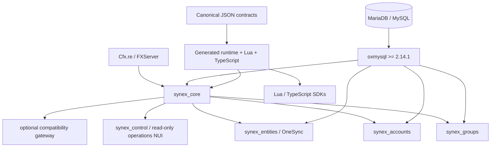

<p align="center">
  
</p>

<h1 align="center">Synex</h1>

<p align="center">
  <strong>A contract-first FiveM runtime and foundation for independently owned resources.</strong>
</p>

<p align="center">
  Synex binds resource identity, lifecycle, policy, persistence, and observability behind a small versioned API.<br>
  Foundation domains build on the kernel without becoming one mutable framework object.
</p>

<p align="center">
  <strong>EN</strong>
  &nbsp;&middot;&nbsp;
  <a href="./docs/locales/de/README.md">DE</a>
  &nbsp;&middot;&nbsp;
  <a href="./docs/locales/fr/README.md">FR</a>
  &nbsp;&middot;&nbsp;
  <a href="./docs/locales/es/README.md">ES</a>
  &nbsp;&middot;&nbsp;
  <a href="./docs/locales/pt-BR/README.md">PT-BR</a>
</p>

<p align="center">
  <a href="#why-synex">Why Synex</a> &middot;
  <a href="#implemented-foundation">Foundation</a> &middot;
  <a href="#architecture">Architecture</a> &middot;
  <a href="#getting-started">Getting started</a> &middot;
  <a href="./docs/README.md">Documentation</a> &middot;
  <a href="https://discord.gg/heJU5t2Hfa">Discord</a>
</p>

<p align="center">
  
  
  
  <a href="./LICENSE"></a>
</p>

<p align="center">
  <a href="https://discord.gg/heJU5t2Hfa">
    
  </a>
</p>

<p align="center">
  
</p>

> [!CAUTION]
> **Experimental source release.** Synex `0.1.0` contains runnable foundation resources, generated contracts, migrations, tests, and tooling. Its public contracts are still marked `experimental`; the repository has no stable release, packaged installer, or production-support claim.

## Why Synex

- **Caller-bound APIs.** Core exports capture the immediate resource principal and return epoch-bound facades that expire on restart.
- **Contract-first boundaries.** Versioned JSON contracts generate runtime descriptors, Lua metadata, TypeScript types, and API reference material.
- **Server authority.** Network entry points are explicit and bounded; client and NUI input remains untrusted.
- **Owned persistence.** Migrations and tables belong to one resource, with checksums, database-time leases, and forward-only history.
- **Lifecycle cleanup.** RPC handlers, services, hooks, subscriptions, states, schedules, and pending ownership are tracked by resource epoch.
- **Evidence over claims.** Headless, static, compatibility, and live MariaDB tests are present; their platform limits are documented.

## Implemented foundation

| Layer | Resource or package | Verified responsibility | Maturity |
| --- | --- | --- | --- |
| Kernel | [`synex_core`](./core/synex_core/) | Boot/session/character lifecycle, contracts, RPC, events, hooks, services, capabilities, persistent RBAC/access policy, state, reliability, audit, metrics, health | Experimental |
| Groups | [`synex_groups`](./resources/synex_groups/) | Durable groups, grades, grade capability rules, primary selection, and versioned memberships | Experimental |
| Accounts | [`synex_accounts`](./resources/synex_accounts/) | Currencies, double-entry accounts, holds, access roles, reversals, and integrity read models | Experimental |
| Entities | [`synex_entities`](./resources/synex_entities/) | Server-authoritative entity identity, persistent resolution, routing buckets, Net ID generation checks | Experimental |
| Operations | [`synex_control`](./resources/synex_control/) | Read-only in-game operational NUI with bounded Core/domain views, exact audit search, and transparent closed state | Experimental |
| Contracts | [`packages/contracts`](./packages/contracts/) | Canonical discovery and deterministic generated runtime/docs artifacts | Experimental |
| SDKs | [`packages/sdk-lua`](./packages/sdk-lua/) / [`packages/sdk-ts`](./packages/sdk-ts/) | Generated contract clients and types; TypeScript transport is host-provided | Experimental |
| Tooling | [`tools/cli`](./tools/cli/) | Validate, inspect, generate, create, doctor, permissions, scan, certify, benchmark, compatibility, upgrade checks | Experimental |
| Compatibility | [`synex_bridge`](./libraries/synex_bridge/) | Optional native QB/QBX/ESX transition shims plus review-gated legacy data import | Experimental / deprecated path |

The compatibility layer is intentionally narrow. It provides bounded callbacks and lifecycle projections plus cash/bank mutations as balanced Synex transfers. It does not expose mutable player objects, direct SQL, offline lookup, inventory, arbitrary currencies, or job/group authorization mutations.

### Reserved ecosystem boundaries

The following directories currently contain scaffolds only and are **not runnable features**: `synex_character`, `synex_identity`, `synex_inventory`, `synex_banking`, `synex_phone`, `synex_radio`, `synex_jobs`, `synex_shops`, `synex_vehicles`, `synex_garages`, and `synex_ui`.

Character and session behavior that exists today is part of `synex_core`; the reserved gameplay/domain resources above must not be inferred from their directory names.

## Architecture



Arrows show runtime requirements or generated-input flow. Domain resources own their tables and call other domains through contracts or versioned services; they do not receive mutable core registries or a raw global framework object.

The core separates users, sessions, characters, ephemeral player sources, and source generations. Resource manifests declare API ranges, services, contracts, capabilities, migrations, and data ownership. A capability declaration records intent; operator policy must grant it, and deny rules take precedence.

[Read the architecture documentation](./docs/architecture/README.md)

## Getting started

Requirements: a current FXServer artifact, MariaDB/MySQL through `oxmysql >= 2.14.1` (and `< 3.0.0` when `synex_entities` is enabled), a stable `synex_instance_id` in strict production, and OneSync `on` for `synex_entities`. Node.js is required for repository generation and tests, not for the Lua runtime.

```bash
npm ci
npm run check
npm test
npm run security
npm run certify
```

The repository is a development monorepo rather than a packaged server release. Follow the tested placement, configuration, migration, start-order, and verification notes before enabling resources:

[Open the getting-started guide](./docs/getting-started.md)

## Development model

```lua
local api, apiError = exports.synex_core:GetAPI('^1.0.0')
if not api then error(apiError.message) end

local group, groupError = api.RPC.call(
    'synex.groups.get',
    '1.0.0',
    { group_id = groupId }
)
```

Calls return `value, nil` or `nil, error`. The stable error shape contains `code`, `message`, optional `traceId`, `retryable`, and optional bounded `details`. Runtime validation and capability checks remain active even when generated SDK metadata is used.

[Public API](./docs/api/README.md) &middot; [Create a resource](./docs/development/creating-resources.md) &middot; [Generated contracts](./packages/contracts/generated/docs/contracts.md)

## Technology

- Lua for FiveM runtime resources
- SQL with MariaDB/MySQL through oxmysql
- TypeScript and Node.js for contracts, SDKs, CLI, analyzers, and tests
- Vanilla HTML, CSS, and JavaScript for the read-only operational control NUI
- JSON Schema for contract, resource-manifest, state, and configuration validation
- GitHub Actions with an isolated MariaDB integration job

There is no React/Vite application, external telemetry service, hosted control API, or automatic remote updater in the current repository.

## Documentation

- [Documentation index](./docs/README.md)
- [Runtime model](./docs/architecture/runtime.md)
- [Security model](./docs/architecture/security.md)
- [Database and migrations](./docs/reference/database.md)
- [Operations](./docs/operations.md)
- [Testing and CI](./docs/testing.md)
- [Entity authority](./docs/reference/entities.md)
- [Groups](./docs/reference/groups.md) and [accounts/ledger](./docs/reference/accounts.md)
- [Compatibility and migration](./docs/compatibility/README.md)
- [Discord notification automation](./docs/discord-notifications.md)

## License

Copyright &copy; 2026 PixelGG. Synex is licensed under the [GNU Affero General Public License v3.0 only](./LICENSE).

## Repository structure

```text
Synex_Framework/
├── core/synex_core/           # runtime kernel and owned migrations
├── resources/                 # implemented foundation resources + planned scaffolds
├── libraries/synex_bridge/    # optional compatibility gateway
├── packages/                  # canonical contracts and generated SDKs
├── schemas/                   # JSON Schemas
├── tools/                     # CLI and migration planner
├── tests/                     # headless, static, compatibility, docs, and database tests
├── examples/synex_example/    # minimal server-only provider
└── docs/                      # architecture, operations, references, and translations
```

---

<p align="center">
  <sub>Synex Framework &middot; Explicit contracts. Owned state. Honest boundaries.</sub>
</p>
