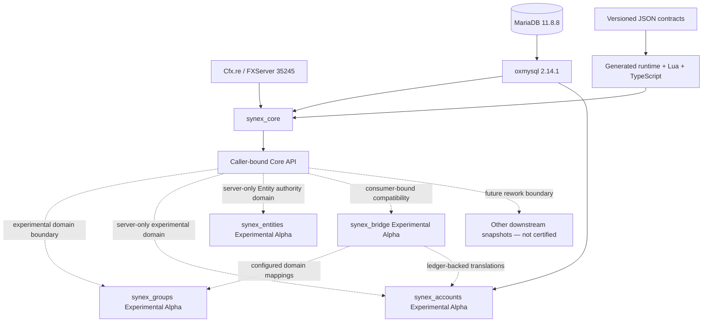

<p align="center">
  
</p>

<h1 align="center">Synex</h1>

<p align="center">
  <strong>A modular FiveM framework built around explicit ownership, contracts, and fail-closed boundaries.</strong>
</p>

<p align="center">
  <code>synex_core</code> provides the runtime foundation; Groups, Accounts and Entity Authority are separate experimental domains.<br>
  Each module keeps its own release boundary and must earn maturity through exact-candidate evidence.
</p>

<p align="center">
  <strong>EN</strong>
  &nbsp;&middot;&nbsp;
  <a href="./docs/locales/de/README.md">DE</a>
  &nbsp;&middot;&nbsp;
  <a href="./docs/locales/fr/README.md">FR</a>
  &nbsp;&middot;&nbsp;
  <a href="./docs/locales/es/README.md">ES</a>
  &nbsp;&middot;&nbsp;
  <a href="./docs/locales/pt-BR/README.md">PT-BR</a>
</p>

<p align="center">
  <a href="#current-verification">Verification</a> &middot;
  <a href="#architecture">Architecture</a> &middot;
  <a href="#getting-started">Getting started</a> &middot;
  <a href="./docs/README.md">Documentation</a> &middot;
  <a href="https://discord.gg/heJU5t2Hfa">Discord</a>
</p>

<p align="center">
  
  
  
  <a href="https://github.com/PixelGG/Synex_Framework/actions/workflows/framework-ci.yml?query=branch%3Amain"></a>
  <a href="./LICENSE"></a>
</p>

<p align="center">
  
</p>

> [!IMPORTANT]
> **Synex Core baseline — PRODUCTION BETA.** One frozen `synex_core` candidate passed the first Core-only Production-Beta profile. The current workspace extends that baseline with additive primitives and separate Experimental Alpha domains. Those changes do not inherit the frozen Core decision. Synex `0.1.0` is not Stable/1.0 or a framework-wide production-support claim.

## Current verification

`synex_core` passed the frozen Production-Beta acceptance line on **2026-08-25** for the exact profile below. The decision applies only to Core commit `7ad4b72ee9bcd0a2a0481cfacfe5f807eb1b3ec5` and Core tree `9f0960f1e27fe43195ae4602cb2ef447cbc0509b`. It is historical evidence for the baseline, not certification of uncommitted or later Core changes.

| Closure item | Current state |
| --- | --- |
| Final server database-outage and recovery run | PASS |
| Complete automated closing run | PASS — `npm run check`; 416 passed, 0 failed, 19 expected live-DB skips; security: 0 findings; audit: 0 vulnerabilities |
| Repository-wide documentation synchronization | PASS |
| Client smoke test: join, disconnect, reconnect | PASS — ordered nine-stage join pipeline, clean disconnect, reconnect, and final cleanup |
| Final diff and secret review; commit and publication to `main` | PASS |

- **PRODUCTION-BETA ACCEPTED.** Server database-outage recovery, the automated closing run, documentation synchronization, client smoke, final review, and publication gates passed for the exact Core-only profile.
- **LIVE CLIENT VERIFIED.** Join completed through all nine ordered connection stages, followed by a clean disconnect and successful reconnect. Doctor returned `PASS`, all 26 migrations were applied, and final cleanup left 3 closed sessions, 0 open sessions, and 0 active session or admission leases.
- **LIMITED MATURITY.** This acceptance does not promote Synex to Stable/1.0, certify the complete framework, or change public Core contracts from `experimental`.
- **NOT CERTIFIED.** MySQL and multi-instance operation, including `kick_old`, are outside the accepted Production-Beta profile.
- **OUT OF SCOPE.** `synex_groups`, `synex_accounts`, `synex_entities`, every other runtime resource, all libraries, bridges, and examples remain outside the frozen Core certification. Groups, Accounts and Entities have separate Experimental Alpha boundaries; none inherits Core acceptance.

<details>
<summary>Post-Beta hardening — explicitly not part of this acceptance gate</summary>

- 125-minute soak
- permanent evidence runner
- historical upgrade rehearsal
- extended backup-and-restore rehearsal
- additional non-critical ABI tests

These checks are scheduled for the work required to move beyond Beta. They do not expand the frozen Production-Beta closure line.

</details>

[Release gate](./docs/release-readiness.md) &middot; [Current test coverage](./docs/testing.md) &middot; [Known limitations](./docs/known-limitations.md)

### Organizations Engine — Experimental Alpha

`synex_groups` remains an Experimental Alpha while its expanded contract and read-model surface completes acceptance. The historical runtime evidence below applies to the working tree tested on **2026-08-25**; later Accounts and Core changes do not inherit or refresh that evidence. It is not a Production-Beta, production-readiness, support, or publication decision.

| Alpha evidence | Result |
| --- | --- |
| Repository gates | PASS — `npm run check`; 644 passed, 0 failed, 24 expected live-DB skips out of 668 tests; focused Groups suite 197/197; security 174 files / 0 findings; audit 0 vulnerabilities |
| Historical source contract catalog | 68 Groups contracts / 143 total at the tested revision; exactly `synex.groups.self.snapshot` was `client-to-server` |
| Real Groups Lua benchmark | PASS — six production Lua hot paths measured locally through deterministic in-memory adapters; no FXServer or database-performance claim |
| Disposable MariaDB gate | PASS — 96/96 live tests, 0 skipped |
| Isolated FXServer startup and Doctor | PASS — fresh Git-ignored local environment; Core 27/27 plus Groups 30/30 migrations applied, Core `READY`, both resources `HEALTHY`, Doctor `PASS` |
| Groups/Core restart recovery | PASS — Groups restart advanced its owner epoch; Core restart produced the expected dependency stop, and `ensure synex_groups` restored both resources to `HEALTHY` with Doctor `PASS` |
| Client projection smoke | **PENDING** — no manual FiveM client test has run for `synex.groups.self.snapshot` |
| Candidate closure | **PENDING** — review the exact committed revision and make an explicit owner maturity/publication decision |

The resource manifest deliberately keeps Groups non-critical (`critical: false`), and its only direct runtime dependency is `synex_core`. These boundaries do not promote the module beyond Experimental Alpha.

### Accepted Production-Beta profile

| Boundary | Accepted value |
| --- | --- |
| Product | `synex_core` only |
| Host | Windows |
| Runtime | FXServer build `35245` |
| Database adapter | `oxmysql 2.14.1` |
| Database | MariaDB `11.8.8`, UTC session time |
| Topology | One active Core instance |
| Production policy | `synex_environment "production"`, `synex_strict "1"`, `synex_duplicate_policy "deny_new"` |

The Production-Beta decision is valid only inside these boundaries. A different platform, dependency version, topology, or policy requires separate acceptance evidence.

## Why Synex

- **Caller-bound APIs.** Core exports capture the immediate resource principal and return epoch-bound facades that expire on restart.
- **Contract-first boundaries.** Versioned JSON contracts generate runtime descriptors, Lua metadata, TypeScript types, and API reference material.
- **Server authority.** Network entry points are explicit and bounded; client and NUI input remains untrusted.
- **Owned persistence.** Migrations and tables belong to one resource, with checksums, database-time leases, and forward-only history.
- **Lifecycle cleanup.** RPC handlers, services, hooks, subscriptions, states, schedules, and pending ownership are tracked by resource epoch.
- **Evidence over claims.** Headless, static, compatibility, and live MariaDB tests are present; their platform limits are documented.

## Repository scope

| Area | Repository path | Current role |
| --- | --- | --- |
| Core runtime | [`synex_core`](./core/synex_core/) | Boot, connection/session/character lifecycle, contracts, RPC, events, hooks, services, capabilities, persistent access policy, state, reliability, audit, metrics, health, and owned migrations; the frozen baseline is accepted separately from current additions |
| Organizations Engine — Experimental Alpha | [`synex_groups`](./resources/synex_groups/) | Server-authoritative groups, memberships, hierarchy, roles, scoped capabilities, policies, workflows, bounded self projection, runtime indices, history, and diagnostics; non-critical and outside Core certification |
| Financial Engine — Experimental Alpha | [`synex_accounts`](./resources/synex_accounts/) | Server-only currencies, accounts, multi-leg ledger, holds, access policy, integrity, audit, outbox, and lifecycle integration; real runtime acceptance deferred |
| Entity Authority Engine — Experimental Alpha | [`synex_entities`](./resources/synex_entities/) | Server-only stable EntityRefs, OneSync materialization, domain bindings, ownership, routing buckets, components/state, persistence, authority leases, recovery and read-only diagnostics; live acceptance deferred |
| Operations Control Plane — Experimental Alpha | [`synex_control`](./resources/synex_control/) | Optional read-only, provider-driven Core/domain diagnostics with lazy bounded views, opaque pagination, sanitization, and a standalone NUI; real provider-runtime and CEF acceptance deferred |
| Compatibility Platform — Experimental Alpha | [`synex_bridge`](./libraries/synex_bridge/) | Catalog-gated QB, QBX and ESX projections, historical facades, persistent legacy identity/metadata, ledger-backed money translation, Groups mapping, bounded callbacks, lifecycle/event coordination, catalogs, adapters, profiles, telemetry, Control/Doctor and migration tooling; exact FXServer/client acceptance deferred |
| Contract pipeline | [`packages/contracts`](./packages/contracts/) | Canonical inputs and deterministic generated runtime/reference artifacts used to validate Core development |
| SDK and tooling | [`packages`](./packages/) / [`tools`](./tools/) | Generated clients/types, validation, migration, security, certification, and test tooling; not separately certified server features |

The certification boundary is deliberately narrow: **only the frozen `synex_core` tree named above was accepted as Production-Beta-ready for that profile.** Current Core additions and every domain resource remain outside that decision until their own exact revisions receive an explicit release decision.

### Downstream rework boundary

`synex_groups` is the active Experimental Alpha Organizations Engine. Its implementation, 71 contracts, and 31 owned migrations through ID `032` are present. The current expansion adds authorized relationship, assignment, and duty reads, automatic relationship expiry, a revision-bound definition cache with diagnostics, owner-epoch-fenced extension-registry synchronization, a compatibility-facing Core UUID contract, and one bounded self-only client projection. Earlier working-tree evidence passed repository, live MariaDB, isolated FXServer, restart, and Doctor checks before migration `032`; it does not certify the current revision. The exact committed revision still needs review, the client projection still needs a manual active-session smoke test, and no owner maturity or publication decision has been made. Groups must not be advertised as Production-Beta or bundled into the frozen Core deployment profile.

`synex_accounts` is now an Experimental Alpha Financial Engine with 59 server-only contracts and 17 owned migrations. Its source implements principal-scoped idempotency, 2–16-entry multi-leg posting, mint/burn topology, partial and multiple holds, access policies and restrictions, reversal/refund, reconciliation, audit/outbox, bounded control summaries, operator inspection, and metrics. On 2026-08-26 its working-tree automated gates passed: focused Accounts 57/57, repository 707 passed / 0 failed / 28 expected live-database skips out of 735, security 201 files / 0 findings, and dependency audit 0 vulnerabilities. These are implementation checks, not runtime acceptance: real MariaDB, FXServer, worker restart/crash-recovery, restored-upgrade, and exact-candidate acceptance remain deliberately deferred. Accounts has no client or NUI; `synex_control` is only a separate read-only operator snapshot, while future gameplay and UI belong to `synex_banking`. See the [Accounts reference](./docs/reference/accounts.md).

`synex_entities` is now a Development / Experimental Alpha Entity Authority Engine. Its source contains 33 server-only versioned contract definitions across 32 names, four owned forward-only migrations, generation-protected Entity identity, server-side vehicle/ped/object materialization, resource/logical/instance authority, managed routing buckets, extension schemas, recovery and read-only Control diagnostics. On 2026-08-26 its working-tree automated gates passed: focused Entities 128/128, repository 815 passed / 0 failed / 29 expected live-database skips out of 844, database scope 72 passed / 0 failed / 29 gated skips, security 228 files / 0 findings, and dependency audit 0 vulnerabilities. These checks do not complete its fresh MariaDB, live FXServer/OneSync, restart/recovery or client acceptance. See the [Entity guide](./docs/entities/overview.md).

`synex_control` now has read-only provider projections for Core, Groups, Accounts, Entities, its own process health, and the optional `synex_bridge` compatibility surface. Its bounded views include keyset Session pages, payload/header-free Core outbox state, process-local Core traces, slow-operation and Security-rejection histories, count-only Character-domain relations, Group/Membership inspection, read-only policy explanation, and Entity recovery-circuit inspection; raw payloads, SQL, pool telemetry and mutation paths remain absent. It remains Development / Experimental Alpha: real FXServer provider lifecycle, CEF focus/closed-state/responsive behavior, invalidation, cursor expiry, and OneSync-backed Entity acceptance are still open. It is not a supported admin or mutation layer.

`synex_bridge` is now an implemented but unaccepted Experimental Alpha Compatibility Platform. It keeps QB, QBX and ESX providers separate, binds server authority to the real consumer resource, exposes detached online player/xPlayer projections plus a read-only QBX offline view, supports cataloged stable-identifier and bounded enumeration forms, routes configured money through `synex_accounts`, routes configured memberships and duty through `synex_groups`, and supplies mapped ESX accounts, read-only QB/ESX permission views, bounded callbacks, data-only global lifecycle events, restart resync, and multi-consumer failover. Optional client player-data/callback access and job, gang/group, duty, money/account update families are separately catalog-gated; client allowlists are API admission rather than confidentiality or server authorization. Accounts/Groups events target matching character projections when safe and fall back globally when identity evidence is unsafe, while metadata writes queue an exact fenced refresh. Shared QBCore event ownership is selected dynamically with QB priority, QBX fallback, and silent handoff. Persistent legacy identity/metadata, catalogs, adapters, profiles, historical-name facades, telemetry, Control/Doctor/CLI and review-gated migration tooling remain part of the platform. Its repository gates and current commit-pinned upstream source set are implementation evidence only. The checked-in configuration enables no consumer, profile, group mapping, money policy or domain adapter, and the surface manifests deliberately classify every entry as `PARTIAL` or `UNSUPPORTED`. Historical-name facades are privileged trusted-computing-base code, not generic drop-ins. Exact MariaDB, FXServer provider/facade restart, mixed-provider event/callback, deployment mapping, third-party flow, and real-client acceptance remain pending, so Bridge does not inherit Core Production-Beta support.

Every later or otherwise separate directory under `resources/`, remaining libraries, and runnable examples remain experimental rework snapshots or scaffolds.

This also applies to the reserved gameplay names `synex_character`, `synex_identity`, `synex_inventory`, `synex_banking`, `synex_phone`, `synex_radio`, `synex_jobs`, `synex_shops`, `synex_vehicles`, `synex_garages`, and `synex_ui`. Directory presence does not imply a finished feature. Character and session behavior accepted in the current Core profile belongs to `synex_core`.

## Architecture



Solid arrows show the frozen Core profile's runtime or generated-input flow. Dashed edges mark development APIs; neither the Organizations Engine Alpha, Financial Engine Alpha, Entity Authority Alpha, nor another downstream consumer inherits Core acceptance.

The core separates users, sessions, characters, ephemeral player sources, and source generations. Resource manifests declare API ranges, services, contracts, capabilities, migrations, and data ownership. A capability declaration records intent; operator policy must grant it, and deny rules take precedence.

[Read the architecture documentation](./docs/architecture/README.md)

## Getting started

The accepted Production-Beta profile requires Windows, FXServer build `35245`, `oxmysql 2.14.1`, MariaDB `11.8.8`, one stable unique `synex_instance_id`, strict production mode, and `deny_new`. Node.js `>=22.12.0` with npm `>=10.0.0` is required for repository generation and tests, not for the Lua runtime.

```bash
git clone https://github.com/PixelGG/Synex_Framework.git
cd Synex_Framework
npm ci
npm run check
npm test
npm run security
npm run certify
```

These checks are required development gates; they are not by themselves Production-Beta evidence. This repository remains a development monorepo rather than a packaged server release. Deploy only `oxmysql` and the frozen accepted `synex_core` revision when relying on the documented Core profile. Treat Organizations, Financial and Entity Authority Engines as separate Experimental Alpha candidates, keep credentials in an operator-owned local file, and follow the reviewed configuration and acceptance instructions:

[Getting started](./docs/getting-started.md) &middot; [Core server configuration](./examples/server.cfg.example) &middot; [Release readiness](./docs/release-readiness.md)

## Development model

```lua
local api, apiError = exports.synex_core:GetAPI('^1.0.0')
if apiError then error(apiError.message) end

local status, statusError = api.Runtime.status()
if statusError then error(statusError.message) end

print(('Synex Core state: %s'):format(status.state))
```

The calling server resource must declare `synex.runtime.read`, and operator policy must grant it. Internal operations use `value, nil` or `nil, error`. Raw cross-resource Cfx calls preserve later return values by replacing only intervening `nil` slots with `false`, so a raw failure arrives as `false, error`; always treat the second return slot as authoritative. Capability and caller-epoch validation remains active. This example uses only the Core facade and does not depend on a downstream module.

[Public API](./docs/api/README.md) &middot; [Create a resource](./docs/development/creating-resources.md) &middot; [Generated contracts](./packages/contracts/generated/docs/contracts.md)

## Technology

- Lua for the FiveM Core runtime
- SQL with MariaDB `11.8.8` through `oxmysql 2.14.1` in the first acceptance target profile
- TypeScript and Node.js for contracts, SDKs, CLI, analyzers, and tests
- Wasmoon for headless execution of real Groups, Accounts and Entity Lua paths in deterministic local regression benchmarks
- JSON Schema for contract, resource-manifest, state, and configuration validation
- GitHub Actions with an isolated MariaDB integration job

MySQL remains a code-compatibility target, not a certified Production-Beta database. The Wasmoon measurements use in-memory adapters and exclude FXServer, Cfx networking, OneSync scheduling, and MariaDB I/O; they are regression evidence, not production-performance claims. Repository snapshots outside the Core scope may use additional technologies, but they are not part of this runtime claim. There is no external telemetry service, hosted control API, or automatic remote updater in the current repository.

## Documentation

- [Documentation index](./docs/README.md)
- [Core Production-Beta release gate](./docs/release-readiness.md)
- [Known limitations](./docs/known-limitations.md)
- [Backup and restore](./docs/backup-and-restore.md)
- [Runtime model](./docs/architecture/runtime.md)
- [Security model](./docs/architecture/security.md)
- [Security policy](./SECURITY.md)
- [Database and migrations](./docs/reference/database.md)
- [Operations](./docs/operations.md)
- [Testing and CI](./docs/testing.md)
- [Organizations Engine](./docs/groups/overview.md)
- [Entity Authority Engine](./docs/entities/overview.md)
- [Read-only Control Plane](./docs/reference/control-plane.md)
- [Compatibility bridges and migration boundary](./docs/compatibility/README.md)

## Community

Development discussion, implementation feedback, and framework updates are available in the official Synex community.

<p align="center">
  <a href="https://discord.gg/heJU5t2Hfa">
    
  </a>
</p>

## License

Copyright &copy; 2026 PixelGG. Synex is licensed under the [GNU Affero General Public License v3.0 only](./LICENSE).

## Repository structure

```text
Synex_Framework/
├── core/synex_core/           # Core runtime; frozen baseline accepted separately
├── resources/                 # Experimental Alpha, rework snapshots, and scaffolds
├── libraries/                 # experimental libraries, including the unaccepted Bridge platform
├── packages/                  # contracts and generated development SDKs
├── schemas/                   # JSON Schemas
├── tools/                     # CLI and migration planner
├── tests/                     # headless, static, compatibility, docs, and database tests
├── examples/                  # configuration templates and unsupported development examples
└── docs/                      # architecture, operations, references, and translations
```

---

<p align="center">
  <sub>Synex Framework &middot; Explicit contracts. Owned state. Honest boundaries.</sub>
</p>
