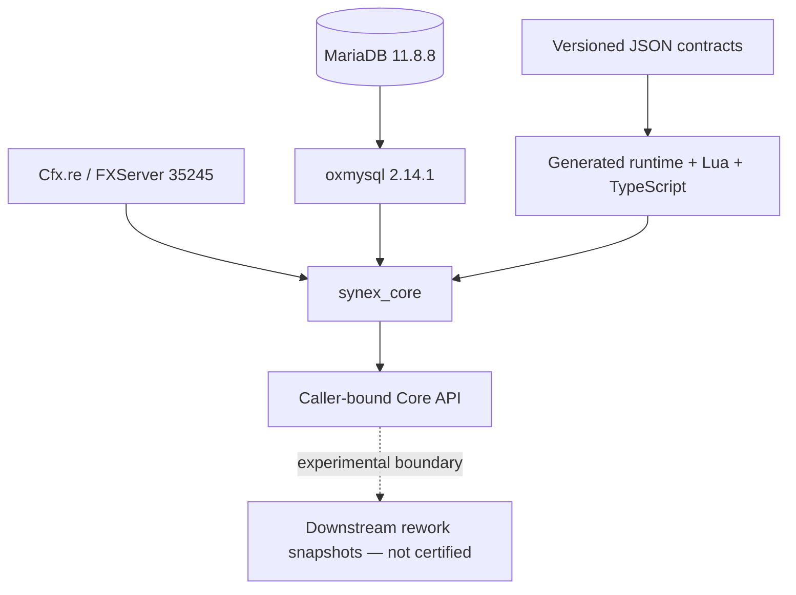

<p align="center">
  
</p>

<h1 align="center">Synex</h1>

<p align="center">
  <strong>A contract-first FiveM Core built around explicit ownership and fail-closed boundaries.</strong>
</p>

<p align="center">
  <code>synex_core</code> binds resource identity, lifecycle, policy, persistence, and observability behind a versioned API.<br>
  Downstream modules remain outside the current certification boundary while they are reworked.
</p>

<p align="center">
  <strong>EN</strong>
  &nbsp;&middot;&nbsp;
  <a href="./docs/locales/de/README.md">DE</a>
  &nbsp;&middot;&nbsp;
  <a href="./docs/locales/fr/README.md">FR</a>
  &nbsp;&middot;&nbsp;
  <a href="./docs/locales/es/README.md">ES</a>
  &nbsp;&middot;&nbsp;
  <a href="./docs/locales/pt-BR/README.md">PT-BR</a>
</p>

<p align="center">
  <a href="#current-verification">Verification</a> &middot;
  <a href="#architecture">Architecture</a> &middot;
  <a href="#getting-started">Getting started</a> &middot;
  <a href="./docs/README.md">Documentation</a> &middot;
  <a href="https://discord.gg/heJU5t2Hfa">Discord</a>
</p>

<p align="center">
  
  
  
  <a href="https://github.com/PixelGG/Synex_Framework/actions/workflows/framework-ci.yml?query=branch%3Amain"></a>
  <a href="./LICENSE"></a>
</p>

<p align="center">
  
</p>

> [!IMPORTANT]
> **Synex Core — PRODUCTION BETA.** The exact `synex_core` candidate has passed the first Core-only Production-Beta profile. Synex `0.1.0` remains an experimental source release with `experimental` public contracts. This is not a Stable/1.0 release, framework-wide readiness statement, or general production-support claim.

## Current verification

`synex_core` passed the frozen Production-Beta acceptance line on **2026-08-25** for the exact profile below. The decision applies only to Core commit `7ad4b72ee9bcd0a2a0481cfacfe5f807eb1b3ec5` and Core tree `9f0960f1e27fe43195ae4602cb2ef447cbc0509b`.

| Closure item | Current state |
| --- | --- |
| Final server database-outage and recovery run | PASS |
| Complete automated closing run | PASS — `npm run check`; 416 passed, 0 failed, 19 expected live-DB skips; security: 0 findings; audit: 0 vulnerabilities |
| Repository-wide documentation synchronization | PASS |
| Client smoke test: join, disconnect, reconnect | PASS — ordered nine-stage join pipeline, clean disconnect, reconnect, and final cleanup |
| Final diff and secret review; commit and publication to `main` | PASS |

- **PRODUCTION-BETA ACCEPTED.** Server database-outage recovery, the automated closing run, documentation synchronization, client smoke, final review, and publication gates passed for the exact Core-only profile.
- **LIVE CLIENT VERIFIED.** Join completed through all nine ordered connection stages, followed by a clean disconnect and successful reconnect. Doctor returned `PASS`, all 26 migrations were applied, and final cleanup left 3 closed sessions, 0 open sessions, and 0 active session or admission leases.
- **LIMITED MATURITY.** This acceptance does not promote Synex to Stable/1.0, certify the complete framework, or change public Core contracts from `experimental`.
- **NOT CERTIFIED.** MySQL and multi-instance operation, including `kick_old`, are outside the accepted Production-Beta profile.
- **OUT OF SCOPE.** Every runtime resource, library, bridge, and example downstream of `synex_core` is an experimental rework snapshot or scaffold and is not part of Core certification.

<details>
<summary>Post-Beta hardening — explicitly not part of this acceptance gate</summary>

- 125-minute soak
- permanent evidence runner
- historical upgrade rehearsal
- extended backup-and-restore rehearsal
- additional non-critical ABI tests

These checks are scheduled for the work required to move beyond Beta. They do not expand the frozen Production-Beta closure line.

</details>

[Release gate](./docs/release-readiness.md) &middot; [Current test coverage](./docs/testing.md) &middot; [Known limitations](./docs/known-limitations.md)

### Accepted Production-Beta profile

| Boundary | Accepted value |
| --- | --- |
| Product | `synex_core` only |
| Host | Windows |
| Runtime | FXServer build `35245` |
| Database adapter | `oxmysql 2.14.1` |
| Database | MariaDB `11.8.8`, UTC session time |
| Topology | One active Core instance |
| Production policy | `synex_environment "production"`, `synex_strict "1"`, `synex_duplicate_policy "deny_new"` |

The Production-Beta decision is valid only inside these boundaries. A different platform, dependency version, topology, or policy requires separate acceptance evidence.

## Why Synex

- **Caller-bound APIs.** Core exports capture the immediate resource principal and return epoch-bound facades that expire on restart.
- **Contract-first boundaries.** Versioned JSON contracts generate runtime descriptors, Lua metadata, TypeScript types, and API reference material.
- **Server authority.** Network entry points are explicit and bounded; client and NUI input remains untrusted.
- **Owned persistence.** Migrations and tables belong to one resource, with checksums, database-time leases, and forward-only history.
- **Lifecycle cleanup.** RPC handlers, services, hooks, subscriptions, states, schedules, and pending ownership are tracked by resource epoch.
- **Evidence over claims.** Headless, static, compatibility, and live MariaDB tests are present; their platform limits are documented.

## Core beta scope

| Area | Repository path | Current role |
| --- | --- | --- |
| Accepted Core runtime | [`synex_core`](./core/synex_core/) | Boot, connection/session/character lifecycle, contracts, RPC, events, hooks, services, capabilities, persistent access policy, state, reliability, audit, metrics, health, and owned migrations |
| Contract pipeline | [`packages/contracts`](./packages/contracts/) | Canonical inputs and deterministic generated runtime/reference artifacts used to validate Core development |
| SDK and tooling | [`packages`](./packages/) / [`tools`](./tools/) | Generated clients/types, validation, migration, security, certification, and test tooling; not separately certified server features |

The certification boundary is deliberately narrow: **only `core/synex_core` is accepted as Production-Beta-ready for the exact profile above.** Its public API remains experimental.

### Downstream rework boundary

`synex_groups`, `synex_accounts`, `synex_entities`, `synex_control`, every later or otherwise separate directory under `resources/`, all libraries and bridges under `libraries/` (including `synex_bridge`), and the runnable examples are **pending rework**; their current contents are experimental snapshots or scaffolds. They are entirely excluded from the Core beta and must not be started, bundled, or advertised as certified components. OneSync-dependent downstream behavior is likewise outside this Core-only profile.

This also applies to the reserved gameplay names `synex_character`, `synex_identity`, `synex_inventory`, `synex_banking`, `synex_phone`, `synex_radio`, `synex_jobs`, `synex_shops`, `synex_vehicles`, `synex_garages`, and `synex_ui`. Directory presence does not imply a finished feature. Character and session behavior accepted in the current Core profile belongs to `synex_core`.

## Architecture



Solid arrows show the accepted Core profile's runtime or generated-input flow. The dashed edge marks an API boundary that exists for development but does not certify any downstream consumer.

The core separates users, sessions, characters, ephemeral player sources, and source generations. Resource manifests declare API ranges, services, contracts, capabilities, migrations, and data ownership. A capability declaration records intent; operator policy must grant it, and deny rules take precedence.

[Read the architecture documentation](./docs/architecture/README.md)

## Getting started

The accepted Production-Beta profile requires Windows, FXServer build `35245`, `oxmysql 2.14.1`, MariaDB `11.8.8`, one stable unique `synex_instance_id`, strict production mode, and `deny_new`. Node.js `>=22.12.0` with npm `>=10.0.0` is required for repository generation and tests, not for the Lua runtime.

```bash
git clone https://github.com/PixelGG/Synex_Framework.git
cd Synex_Framework
npm ci
npm run check
npm test
npm run security
npm run certify
```

These checks are required development gates; they are not by themselves Production-Beta evidence. This repository remains a development monorepo rather than a packaged server release. Deploy only `oxmysql` and `synex_core` for the accepted profile, keep credentials in an operator-owned local file, and follow the reviewed configuration and acceptance instructions:

[Getting started](./docs/getting-started.md) &middot; [Core server configuration](./examples/server.cfg.example) &middot; [Release readiness](./docs/release-readiness.md)

## Development model

```lua
local api, apiError = exports.synex_core:GetAPI('^1.0.0')
if apiError then error(apiError.message) end

local status, statusError = api.Runtime.status()
if statusError then error(statusError.message) end

print(('Synex Core state: %s'):format(status.state))
```

The calling server resource must declare `synex.runtime.read`, and operator policy must grant it. Internal operations use `value, nil` or `nil, error`. Raw cross-resource Cfx calls preserve later return values by replacing only intervening `nil` slots with `false`, so a raw failure arrives as `false, error`; always treat the second return slot as authoritative. Capability and caller-epoch validation remains active. This example uses only the Core facade and does not depend on a downstream module.

[Public API](./docs/api/README.md) &middot; [Create a resource](./docs/development/creating-resources.md) &middot; [Generated contracts](./packages/contracts/generated/docs/contracts.md)

## Technology

- Lua for the FiveM Core runtime
- SQL with MariaDB `11.8.8` through `oxmysql 2.14.1` in the first acceptance target profile
- TypeScript and Node.js for contracts, SDKs, CLI, analyzers, and tests
- JSON Schema for contract, resource-manifest, state, and configuration validation
- GitHub Actions with an isolated MariaDB integration job

MySQL remains a code-compatibility target, not a certified Production-Beta database. Repository snapshots outside the Core scope may use additional technologies, but they are not part of this runtime claim. There is no external telemetry service, hosted control API, or automatic remote updater in the current repository.

## Documentation

- [Documentation index](./docs/README.md)
- [Core Production-Beta release gate](./docs/release-readiness.md)
- [Known limitations](./docs/known-limitations.md)
- [Backup and restore](./docs/backup-and-restore.md)
- [Runtime model](./docs/architecture/runtime.md)
- [Security model](./docs/architecture/security.md)
- [Security policy](./SECURITY.md)
- [Database and migrations](./docs/reference/database.md)
- [Operations](./docs/operations.md)
- [Testing and CI](./docs/testing.md)

## Community

Development discussion, implementation feedback, and framework updates are available in the official Synex community.

<p align="center">
  <a href="https://discord.gg/heJU5t2Hfa">
    
  </a>
</p>

## License

Copyright &copy; 2026 PixelGG. Synex is licensed under the [GNU Affero General Public License v3.0 only](./LICENSE).

## Repository structure

```text
Synex_Framework/
├── core/synex_core/           # accepted Core-only Production-Beta runtime
├── resources/                 # unsupported downstream rework snapshots and scaffolds
├── libraries/                 # unsupported libraries and bridge rework snapshots
├── packages/                  # contracts and generated development SDKs
├── schemas/                   # JSON Schemas
├── tools/                     # CLI and migration planner
├── tests/                     # headless, static, compatibility, docs, and database tests
├── examples/                  # configuration templates and unsupported development examples
└── docs/                      # architecture, operations, references, and translations
```

---

<p align="center">
  <sub>Synex Framework &middot; Explicit contracts. Owned state. Honest boundaries.</sub>
</p>
