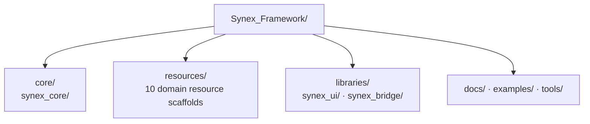

<p align="center">
  
</p>

<h1 align="center">Synex</h1>

<p align="center">
  <strong>A deliberate foundation for a modular FiveM framework and a coherent first-party resource ecosystem.</strong>
</p>

<p align="center">
  <sub>DOCUMENTATION LANGUAGE</sub><br>
  <strong>EN</strong>
  &nbsp;·&nbsp;
  <a href="./docs/locales/de/README.md">DE</a>
  &nbsp;·&nbsp;
  <a href="./docs/locales/fr/README.md">FR</a>
  &nbsp;·&nbsp;
  <a href="./docs/locales/es/README.md">ES</a>
  &nbsp;·&nbsp;
  <a href="./docs/locales/pt-BR/README.md">PT-BR</a>
</p>

<p align="center">
  Synex is being structured as one framework with clear ownership across its core, domain resources, and shared libraries.<br>
  The repository is currently a foundation scaffold: its boundaries are present; runtime code is not part of the current repository.
</p>

<p align="center">
  <a href="#why-synex">Why Synex</a> ·
  <a href="#planned-ecosystem">Ecosystem</a> ·
  <a href="#repository-architecture">Architecture</a> ·
  <a href="#getting-started">Getting started</a> ·
  <a href="#development-status">Status</a>
</p>

<p align="center">
  
  
</p>

<p align="center">
  
</p>

> [!IMPORTANT]
> **Current maturity:** Synex is at the repository-foundation stage. The module boundaries documented below exist, but no runnable FiveM resources, manifests, runtime code, database schema, configuration, or installation workflow have been committed yet.

## Why Synex

A framework ecosystem starts with explicit ownership. Synex establishes those boundaries before presenting implementation details as product capabilities.

- **Boundary-first layout.** Core, domain resources, shared libraries, documentation, examples, and tooling have separate homes.
- **Coherent namespace.** Every reserved framework module uses the `synex_` prefix.
- **Domain-oriented ecosystem.** Character, economy, communication, and vehicle concerns are represented by independent resource scaffolds.
- **Evidence-led maturity.** A directory marks intended ownership; it is not presented as a finished or installable feature.

## Foundation model

| Boundary | Intended responsibility | Verified today |
| --- | --- | --- |
| `core/` | Home of the framework core | `synex_core` scaffold |
| `resources/` | First-party domain resources | 10 named scaffolds |
| `libraries/` | Shared framework libraries | `synex_ui` and `synex_bridge` scaffolds |
| `docs/`, `examples/`, `tools/` | Project guidance, examples, and tooling | Localized READMEs and Discord integration guide; examples and tools reserved |

The layout establishes repository ownership only. It does not yet define runtime dependencies, public contracts, client/server boundaries, or service behavior.

## Planned ecosystem

Every entry below currently has the same verified state: **Scaffold** — the directory exists, but it contains no resource manifest or implementation. The descriptions identify reserved responsibilities, not available features.

| Area | Module | Reserved responsibility |
| --- | --- | --- |
| Foundation | [`synex_core`](./core/synex_core/) | Framework core boundary |
| Foundation | [`synex_ui`](./libraries/synex_ui/) | Shared UI library boundary |
| Foundation | [`synex_bridge`](./libraries/synex_bridge/) | Integration bridge boundary |
| Player | [`synex_character`](./resources/synex_character/) | Character domain boundary |
| Player | [`synex_identity`](./resources/synex_identity/) | Identity domain boundary |
| Player | [`synex_inventory`](./resources/synex_inventory/) | Inventory domain boundary |
| Economy | [`synex_banking`](./resources/synex_banking/) | Banking domain boundary |
| Economy | [`synex_jobs`](./resources/synex_jobs/) | Jobs domain boundary |
| Economy | [`synex_shops`](./resources/synex_shops/) | Shops domain boundary |
| Communication | [`synex_phone`](./resources/synex_phone/) | Phone domain boundary |
| Communication | [`synex_radio`](./resources/synex_radio/) | Radio domain boundary |
| Mobility | [`synex_vehicles`](./resources/synex_vehicles/) | Vehicle domain boundary |
| Mobility | [`synex_garages`](./resources/synex_garages/) | Garage domain boundary |

## Repository architecture

This diagram represents the current framework scaffold. It is intentionally a repository map, not a runtime dependency graph.



Arrows indicate top-level repository placement only. No dependency direction, event flow, callback layer, player service, database layer, or NUI interaction is implied.

## Design principles visible today

- **Namespaced ownership.** Framework-owned module directories share the `synex_` prefix.
- **Separated concerns.** Core, resources, reusable libraries, and project support are distinct top-level areas.
- **One domain per scaffold.** Each planned resource has an independent directory boundary.
- **Claims follow implementation.** APIs, performance characteristics, security guarantees, and compatibility will be documented only when they can be verified from repository artifacts.

## Getting started

> [!NOTE]
> **Installation documentation is currently being prepared.**

There is no verified installation path yet: the repository does not currently contain an `fxmanifest.lua`, dependency definition, configuration, database schema, or resource start order. Commands will be published only after they can be tested against runnable resources.

## Repository structure

<details>
<summary>View the current top-level layout</summary>

```text
Synex_Framework/
├── .gitattributes
├── .github/
│   ├── assets/
│   │   ├── branding/
│   │   └── readme/
│   ├── scripts/
│   │   └── discord/
│   └── workflows/
├── .gitignore
├── core/
│   └── synex_core/
├── resources/
│   ├── synex_character/
│   ├── synex_identity/
│   ├── synex_inventory/
│   ├── synex_banking/
│   ├── synex_phone/
│   ├── synex_radio/
│   ├── synex_jobs/
│   ├── synex_shops/
│   ├── synex_vehicles/
│   └── synex_garages/
├── libraries/
│   ├── synex_ui/
│   └── synex_bridge/
├── tools/
├── docs/
│   ├── discord-notifications.md
│   └── locales/
│       ├── README.md
│       ├── de/README.md
│       ├── fr/README.md
│       ├── es/README.md
│       └── pt-BR/README.md
├── examples/
└── README.md
```

The module directories currently contain only `.gitkeep` placeholders.

</details>

## Technology status

FiveM is the declared target platform. The repository automation uses dependency-free JavaScript modules on Node.js 24 through GitHub Actions. A framework runtime language, NUI stack, database engine, package manager, and resource build pipeline cannot yet be determined from the repository contents.

## Development status

| Area | Verified state |
| --- | --- |
| Repository organization | Present |
| GitHub-to-Discord development feed | Implemented and covered by repository automation tests |
| Core, resource, and library modules | Directory scaffolds only |
| Resource manifests and runtime code | Not present |
| Public APIs, events, exports, and callbacks | Not present |
| Database, configuration, permissions, and security systems | Not present |
| Framework installation workflow and runtime guides | Not available |
| License | Not declared |

## Documentation

- [Discord notification setup, operation, and security](./docs/discord-notifications.md)
- [Localized editions of this landing page](./docs/locales/README.md)

Framework installation and runtime guides are not available yet.

---

<p align="center">
  <sub>Synex Framework · Clear boundaries first. Verified capabilities next.</sub>
</p>
