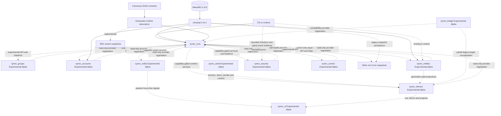

# Synex architecture

Synex separates a small runtime kernel from downstream foundation and gameplay resources. The kernel owns lifecycle, identity, contracts, capability policy, persistent RBAC and connection-access records, communication primitives, persistence ports, the effective retention policy and audit archive mirror, and diagnostics.

The accepted Production-Beta boundary contains one frozen `synex_core` tree only. `synex_groups` is the Experimental Alpha Organizations Engine, `synex_accounts` is the server-only Experimental Alpha Financial Engine, and `synex_entities` is the server-only Development / Experimental Alpha Entity Authority Engine. `synex_notify` is a separate Experimental Alpha feedback-orchestration foundation whose passive visual surface belongs to `synex_ui`. `synex_interact` is the separate Experimental Alpha Context-Aware Interaction Runtime; it consumes World/Entity projections and shared UI surfaces without moving gameplay-domain authority into the client. `synex_security` is a separate observe-first Experimental Alpha detection/correlation foundation with open FXServer/OneSync, MariaDB, restart, hostile-client, gameplay false-positive and runtime-cost acceptance gates. The optional read-only `synex_control` operations surface is also Development / Experimental Alpha: automated provider/transport/NUI gates exist, but real FXServer provider lifecycle and CEF/client acceptance remain open. Bridges, libraries, SDK integrations, examples, gameplay resources, and other downstream entries remain rework snapshots or scaffolds. None is supported by the Core decision.

The authoritative architecture references are:

- [Runtime model](runtime.md)
- [Security model](security.md)
- [Contract and API model](contracts.md)
- [Read-only Control architecture](../control/architecture.md)
- [Notify architecture](../notify/architecture.md)
- [Interact architecture](../interact/architecture.md)
- [Security architecture](../security/architecture.md)
- [Architecture decisions](decisions/README.md)

The runtime is designed for Cfx.re's resource model. It does not claim to sandbox arbitrary server code, make client input trustworthy, or turn a network ID into durable identity. Protected facade calls cross a caller/capability gateway; domain RPC additionally crosses its generated contract boundary.

## Dependency direction

Solid arrows show the accepted Core profile's runtime requirements or generated-input flow. Dotted arrows show experimental relationships outside certification. Groups has only one direct runtime dependency, `synex_core`; Core's caller-bound DataPort validates its SQL against Groups-owned tables declared in the manifest. Its server-authoritative API has 70 server-only contracts plus one bounded, active-session-derived `self.snapshot` client projection. Extension registries use a mandatory begin-per-owner-epoch synchronization session so stale registrations, hydration, and stop cleanup cannot cross a resource restart. Entities declares `synex_core`, `oxmysql`, and OneSync as required runtime dependencies. Notify requires only Core, treats UI and Bridge as optional, owns no database, and sends only exact active-session projections. Interact requires Core, Entities, World and UI; client context remains observed while the server revalidates canonical target, session/source generation, owner epoch, revision, slot and policy before activation. Security requires Core and OneSync, persists only through Core's caller-bound DataPort, and treats its client Sentinel and Cfx observations as bounded evidence rather than authority. Groups, Accounts, Entities, World, Notify, Interact, Security and the optional Bridge compatibility adapter register their own bounded read-only diagnostic providers with the Core registry; Control reads that registry and contributes only its own process-health provider. Neither implementation nor repository checks replace the domains' or Control's open live acceptance gates. Other snapshots still require rework and may retain older direct-adapter boundaries. No downstream resource receives mutable Core registries or implementation objects, and cross-domain behavior uses experimental contracts or versioned services.
