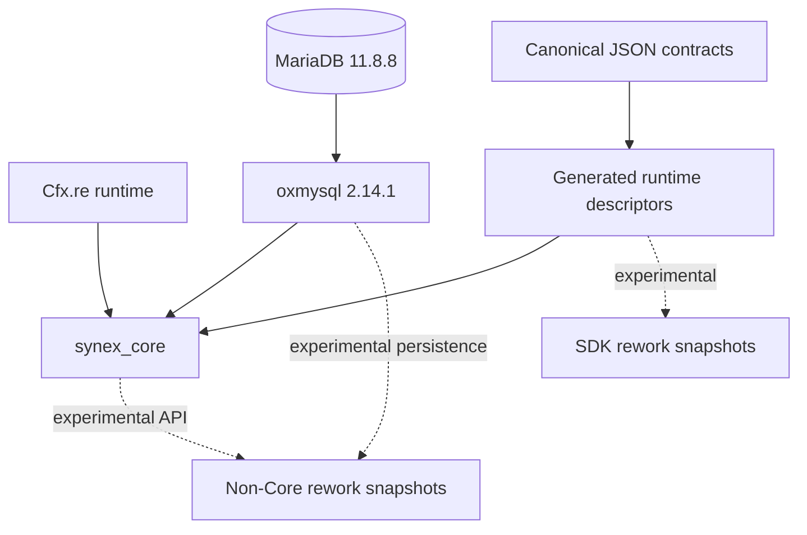

# Synex architecture

Synex separates a small runtime kernel from downstream foundation and gameplay resources. The kernel owns lifecycle, identity, contracts, capability policy, persistent RBAC and connection-access records, communication primitives, persistence ports, the effective retention policy and audit archive mirror, and diagnostics.

The current Production-Beta candidate boundary contains `synex_core` only. Groups, accounts, entity authority, the control NUI, bridges, libraries, SDK integrations, examples, and gameplay resources are experimental rework snapshots or scaffolds. Their presence illustrates the intended dependency direction but does not make them independently deployable or supported today.

The authoritative architecture references are:

- [Runtime model](runtime.md)
- [Security model](security.md)
- [Contract and API model](contracts.md)
- [Architecture decisions](decisions/README.md)

The runtime is designed for Cfx.re's resource model. It does not claim to sandbox arbitrary server code, make client input trustworthy, or turn a network ID into durable identity. Protected facade calls cross a caller/capability gateway; domain RPC additionally crosses its generated contract boundary.

## Dependency direction

Solid arrows show the Core candidate's runtime requirements or generated-input flow. Dotted arrows show currently implemented experimental relationships outside certification. Rework resources obtain caller-bound Core facades and keep persistence behind domain-local modules; they do not receive mutable Core registries or implementation objects. Their current manifests declare the tables they own, while cross-domain behavior uses experimental contracts or versioned services.
