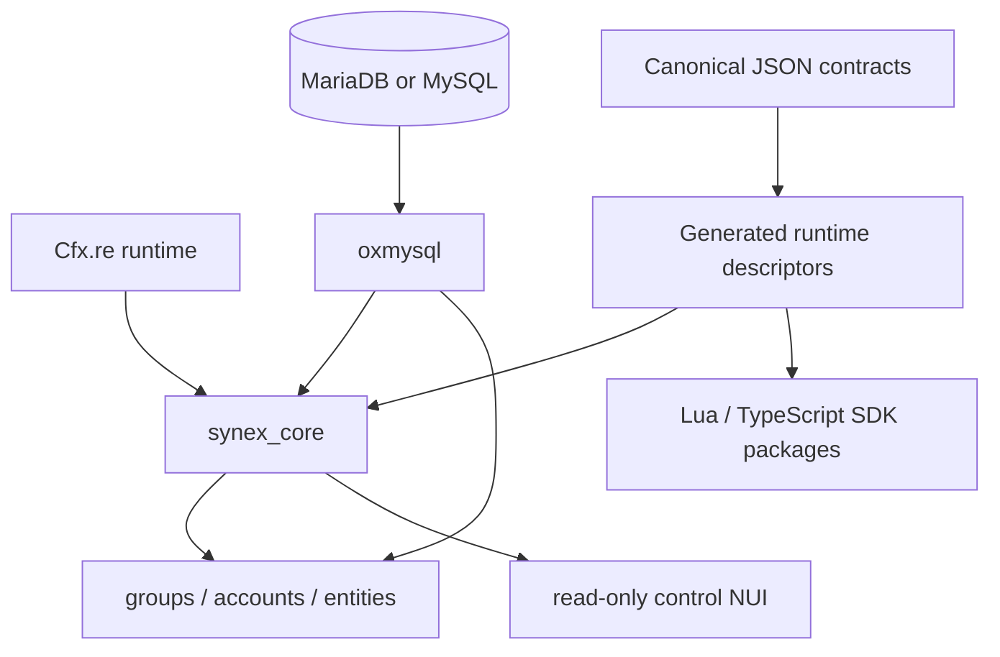

# Synex architecture

Synex separates a small runtime kernel from independently deployable foundation and gameplay resources. The kernel owns lifecycle, identity, contracts, capability policy, persistent RBAC and connection-access records, communication primitives, persistence ports, the effective retention policy and audit archive mirror, and diagnostics. Foundation resources build durable domains such as groups, accounts, and entity authority on those primitives. Gameplay resources remain outside the kernel.

The authoritative architecture references are:

- [Runtime model](runtime.md)
- [Security model](security.md)
- [Contract and API model](contracts.md)
- [Architecture decisions](decisions/README.md)

The runtime is designed for Cfx.re's resource model. It does not claim to sandbox arbitrary server code, make client input trustworthy, or turn a network ID into durable identity. Protected facade calls cross a caller/capability gateway; domain RPC additionally crosses its generated contract boundary.

## Dependency direction

Arrows show current runtime requirements or generated-input flow. Foundation resources obtain caller-bound Core facades and keep persistence behind domain-local modules; they do not receive mutable Core registries or implementation objects. Their manifests declare the tables they own, while cross-domain behavior uses contracts or versioned services.
