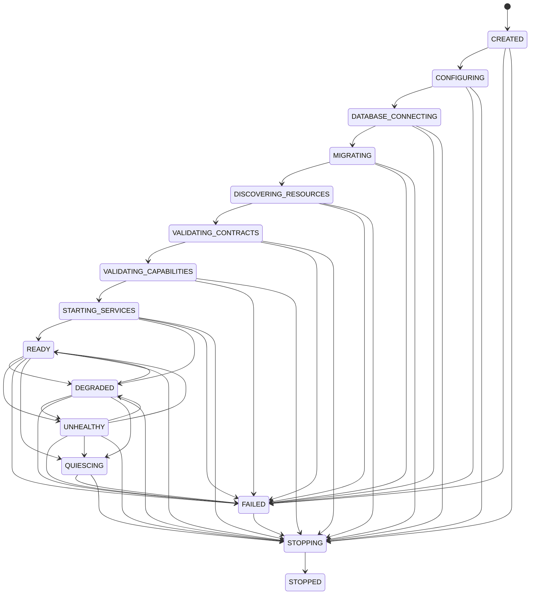
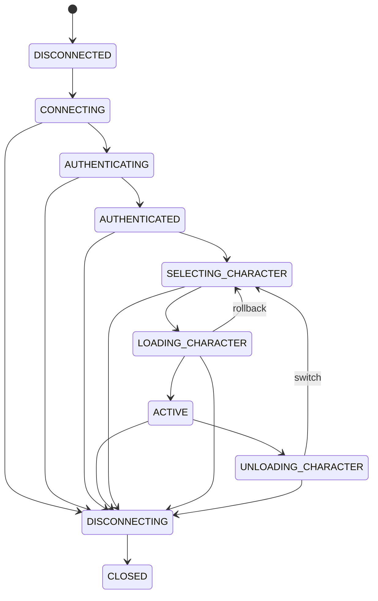

# Runtime model

## Composition root

`synex_core` constructs the runtime from explicit ports for the Cfx runtime, time, IDs, persistence, logging, and metrics. Tests replace those ports with deterministic fakes. Runtime state stays in closures; there is no public mutable `Synex` global or `PlayerData` object.

The core exposes three ABI exports:

- `GetAPI(versionRange?)` returns a caller-bound facade.
- `Invoke(contractName, version, request, options?)` invokes one versioned contract.
- `GetRuntimeStatus()` returns a copied, redacted status snapshot.

`GetInvokingResource()` is captured synchronously at the export boundary. Returned facades are bound to the caller's resource epoch and become invalid after that resource stops or restarts. This is policy enforcement at Synex gateways, not a sandbox for arbitrary server code.

An independent runtime gate stays closed during boot, opens only after the final lifecycle and instance-status writes succeed, and closes synchronously before shutdown or failed-boot cleanup. It guards owner activation, export lookup/invocation, and every method on an already-issued facade. A failed Core therefore cannot recreate owner registrations through handlers that remain bound while Cfx still reports the resource as started.

Committed runtime configuration and capability policy are checked against canonical JSON Schemas by the Node.js CLI. FXServer uses a semantically equivalent Lua validator plus the same explicit cross-field rules after ConVar overrides and before persistence construction; Ajv is not embedded in the game runtime.

## Boot lifecycle

There is no inferred "all resources ready" Cfx event. Synex owns this state machine. Export/facade entry points reject with `CORE_NOT_READY` until validation completes and with `CORE_FAILED` after a terminal boot failure; contract invocation also retains its internal `NOT_READY` lifecycle check.

## Session lifecycle

Users, characters, sessions, and connection attempts are distinct records. A source is an ephemeral transport address and is always paired with a generation.

`playerConnecting` stores the temporary source before deferral and fingerprints the canonical, server-read identifier set without retaining raw values in telemetry. Every successful `defer` or `update` transition is followed by the required tick before another deferral method can run. Acceptance terminates the Cfx deferral with `deferrals.done()` and no argument; rejection passes exactly one bounded `Synex [CODE]` message. Core quiesce permanently closes the terminal registry and queues `CORE_STOPPING` without bypassing the tick rule. Explicit restart preparation flushes the captured terminal set after one tick. The non-yielding raw stop path can finalize only terminals already in the tick-certified `open` state; Cfx teardown owns the remainder. A connection arriving after the fence is rejected through the non-deferral `setKickReason`/`CancelEvent` path. In Lua, passing `nil` explicitly is not equivalent to passing zero arguments at this boundary.

Queue-enabled admission uses one reentrancy-guarded, non-yielding arbiter no more than once per `connections.queueUpdateMs`. A dirty waiting set is sorted once for that interval, then exposes cached ranks and an O(1) waiting count; individual waiters only read their own entry. Staff classification is captured from the server-side ACE decision when the entry is created and never changes afterward. The arbiter skips a nonstaff entry blocked at `maximumActiveSessions - queueReservedSlots`, allowing a later staff entry to use capacity up to `maximumActiveSessions`. Granting and reserving that capacity are one atomic Lua step. A granted entry leaves the waiting rank/count but remains addressable until its waiter revalidates current pending ownership, quiesce state, terminal state, and deadline and consumes or cancels it. The admission reservation then survives validation gates and is exchanged for the registry's O(1) active-session count only when `bindJoined` succeeds; detach and session-state updates do not change that count, while `removeSession` decrements it exactly once. Timeout, abandonment, and quiesce release grants idempotently, and quiesce clears waiting entries, cached ranks, grants, and reservations before a stale waiter can continue.

The resource subscribes locally to the built-in server-side `playerJoining` event without registering it as a network event. Its `source` is the final player source and `oldID` is the temporary source. Before consuming a pending connection, Synex rate-limits the final source, rejects an already-bound source, recomputes the identifier fingerprint, resolves the same active user, and renews the fenced cluster lease. A connection-specific join claim is invalidated by `playerDropped` or Core quiesce even before binding, so a stale continuation cannot claim a reused source from the same account. A mismatch drops only the caller and leaves the unrelated pending connection untouched. The registry then atomically consumes the pending connection, binds the final source, and allocates a new source generation. Session insertion locks the ready instance, exact boot claim, and exact live lease in the same transaction as the insert; a competing restart registration waits for this boundary and its subsequent cleanup observes the committed session. The lease is renewed again after persistence and a lost fence closes the inserted row before `session_opened`. While this persistence fence is unresolved, the bound session carries `persistencePending`, so character mutations fail closed; Core clears the flag only through the same current source generation after the final lease and claim checks. Authenticated or still-authenticating pending leases are renewed in bounded heartbeat batches until join or pending TTL cleanup. Every asynchronous continuation revalidates admission, the pre-bind join claim, and the source identity or the bound `{sessionId, source, generation}` after yielding.

Cross-instance `kick_old` coordination is retained only as bounded operational state. Issuance follows the lock order admission gate, target session/exact active request, global retained-row counter, and requester counters in sorted order. The active-request lookup is forced through `uq_session_control_active` with the generated active marker, so terminal siblings do not expand the interactive lock footprint. A valid exact pending request remains replayable at quota without ownership transfer or another capacity charge; a stale request is terminalized before any replacement reservation. Completed and expired controls are later deleted from separate fair queues after the configured grace, atomically with their requester-boot child and capacity release. Pending rows cannot be deleted by retention, and request IDs are never reused.

Disconnect and local replacement clear player-scoped state while the exact `{session, source, generation}` binding still authorizes state-bag replication, then CAS-detach that binding before network, character, or persistence cleanup continues. State cleanup rechecks its mutation token and generation after every potentially reentrant replication call, so a superseding value or reused source cannot be removed by the stale cleanup. Network in-flight state and RPC rate-limit buckets are likewise keyed and purged by `{source, generation}`. A failed local replacement still attempts character unload, durable close, lease release, and ID-specific registry removal before rejecting the incoming connection; it cannot leave the detached session in the heartbeat set. If Core quiesce wins any replacement yield boundary, replacement stops all later source and persistence side effects with `CORE_STOPPING`; centralized shutdown cleanup owns the remaining old-boot state.

## Lifecycle ownership

The Core lifecycle has one internal health observer that keeps the `synex_core` resource-registry entry aligned with every transition, critical-foundation admission change, and component-health update. The Doctor reports lifecycle `PASS` only for `READY` with admission open and zero health reasons. The bounded dependency-health cycle reconciles this effective health into the persisted instance status. Heartbeats retain the explicit `ready`/`degraded` state, except that a locally live instance may atomically recover its own row from `stale`; the conditional update cannot silently overwrite a concurrent status change.

Every registration returns an opaque token owned by a resource and epoch. A non-Core `onResourceStop` marks that epoch quiescing, rejects new tracked work, drains for a bounded 250 ms, invokes abort callbacks for the remainder, and then removes owned RPC handlers, hooks, subscriptions, service providers, gates, lifecycle participants, state definitions, schedules, and facades.

All runtime deadlines use one wrap-aware monotonic adapter over Cfx's 32-bit game timer, including the signed and unsigned wrap transitions. The scheduler keeps pending work in a deadline heap and arms directly for the earliest deadline instead of scanning every 50 ms. Earlier insertions use generation-fenced rearming with a bounded number of outstanding native timers. Dispatch has a global running-handler cap; cancel and quiesce mark a read-only cooperative cancellation context but keep a detached coroutine counted until it returns, so repeated cancel/reschedule cycles cannot create unbounded handler threads.

Character lifecycle participants are ordered by priority and registration sequence. Their callback deadline defaults to 5 seconds and accepts only `100..30000` ms. It is a cooperative deadline, not hard preemption: a Lua callback that does not return cannot be interrupted, and Core can classify an overrun only after control returns. Load preparation and deletion preflight therefore fail closed for required participants; required activation must finish in `prepare`, registration requires its compensating `rollback`, and registration rejects `commit` unless `required = false`. An optional `commit` is only a best-effort post-activation notification. Failed activation preparation rolls back the failing required participant and every earlier prepared participant in reverse order. While exact caller authority remains current, unload cleanup continues after participant failures and never restores a partially cleaned session to `ACTIVE`; Core completes fail-closed unbinding before reporting a required cleanup failure. Durable character deletion is reconciled separately: an action with `deleteCommit` stays incomplete and retryable until its idempotent callback succeeds. If persisting an unload fails, Core leaves the local session unbound and fail-closed with `persistencePending`, blocks character mutations and reuse, and lets the bounded `core.characters.unload_reconciliation` worker retry the version/source-fenced write.

Character mutations retain the exact local `{sessionId, source, generation}` and cluster `{instance, boot, lease owner, fencing token}` authority across every yielding hook, participant, and database boundary. Character selection and deletion serialize on the same character row before locking the affected open session rows; selection then compare-and-swaps only the caller's exact selecting session, while deletion rejects any open session already using the character. This gives concurrent cross-instance selection one durable winner and makes both select/delete commit orders deterministic. Unload retries repeat the same session, boot, and lease checks and do not mutate local or durable state after authority loss. Character creation serializes on the user's slot-entitlement row, considers only non-deleted characters occupied, and relies on the generated `active_slot_marker` uniqueness constraint so a soft-deleted slot can be reused without allowing two active occupants.

Resources whose manifests opt into snapshot schema `1` can hand off up to 512 non-sensitive `persistent` state values in a 64 KiB in-memory envelope. Restoration is accepted exactly once into the next activated epoch, after the new resource instance has defined compatible states. Each restored value has a mutation token; replication, rollback, and byte-accounting finalization refuse to replace a concurrent newer write. Failed replicated clears remain as bounded, read-hidden cleanup tombstones and are retried fairly by Core. The envelope never survives a Core restart, is not durable persistence, and cannot migrate arbitrary process state or state across schema versions.

The Core's own Cfx stop event is a strict synchronous boundary: it closes the database/runtime gates, admission, and terminal registry in memory, invalidates join claims, removes pending/queued authority, evicts the captured players, finalizes only tick-ready deferrals, clears facade references, and returns. It does not wait, invoke oxmysql, release durable leases, or execute owner cleanup callbacks because a stopping resource cannot rely on a yielded continuation. The console-only `synex prepare-restart` workflow performs the graceful path while Core is still started: mandatory terminal tick, closure of the normal database activity gate, a bounded whole-operation database drain to zero, owner/producer quiesce only after that drain, scheduler/owner evidence, and coroutine-local control work for instance status, captured leases, boot-locked session/control cleanup, and final `stopped`. A database-drain failure before owner teardown may be retried after its blocker clears. Any failure after owner teardown starts is process-terminal for preparation because a purged, cooperatively cancelled handler may still be executing; a retry is rejected and requires a full FXServer-process restart. Only a successful final state exposes the resource restart command.

On an unprepared restart, the next boot evicts residual players, atomically registers the stable instance plus a fresh boot ID as `starting`, performs durable authority cleanup, and seeds the in-memory source-generation floor from the maximum persisted generation for that instance before starting services or opening admission. Connection-authority cleanup uses the migration `026` owner index, separate bounded `admission`/`session` equality scans, exact-name retirement, and a fail-closed residual recheck; unrelated local lease kinds and foreign owners survive. This recovers durable state but cannot cancel an oxmysql interactive transaction already awaiting an invalidated callback from the unloaded Core resource. Callback-clean recovery from arbitrary in-flight database locks therefore requires the prepared workflow or a complete FXServer-process restart that also closes oxmysql connections; an isolated raw Core restart is not such a guarantee. Session-lease acquisition, renewal, and insertion require the requesting instance's exact current boot claim and appropriate ready status. Remote controls carry a durable requester boot claim; `started_at` remains an additional time-consistency check, not the generation authority. The migration worker uses a restart-unique owner plus a durable per-migration fencing token and statement boundary; an unresolved in-flight statement is never automatically reclaimed after expiry. Each saga and character-deletion claim uses an acquisition-unique owner plus the current boot claim. A late boot failure closes the runtime gate before it quiesces connections and purges every owner artifact, leaving the instance non-ready and the lifecycle `FAILED`. Correct persistence never relies on stop-handler completion, and durable writes must complete before success is acknowledged.
