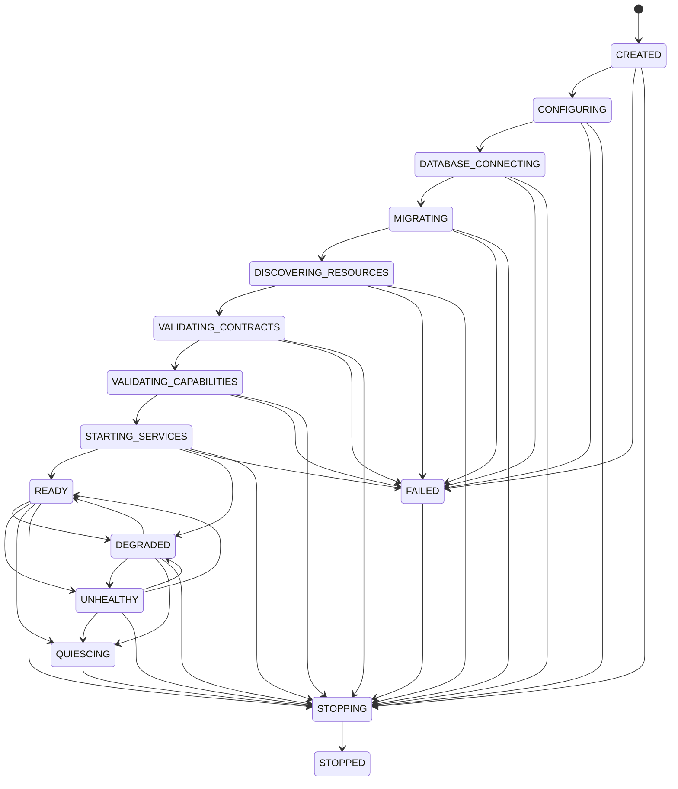
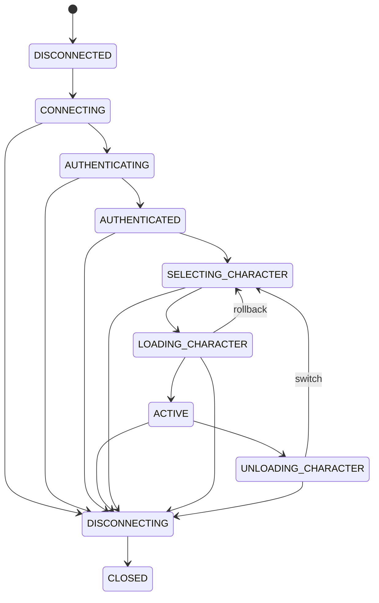

# Runtime model

## Composition root

`synex_core` constructs the runtime from explicit ports for the Cfx runtime, time, IDs, persistence, logging, and metrics. Tests replace those ports with deterministic fakes. Runtime state stays in closures; there is no public mutable `Synex` global or `PlayerData` object.

The core exposes three ABI exports:

- `GetAPI(versionRange?)` returns a caller-bound facade.
- `Invoke(contractName, version, request, options?)` invokes one versioned contract.
- `GetRuntimeStatus()` returns a copied, redacted status snapshot.

`GetInvokingResource()` is captured synchronously at the export boundary. Returned facades are bound to the caller's resource epoch and become invalid after that resource stops or restarts. This is policy enforcement at Synex gateways, not a sandbox for arbitrary server code.

Committed runtime configuration and capability policy are checked against canonical JSON Schemas by the Node.js CLI. FXServer uses a semantically equivalent Lua validator plus the same explicit cross-field rules after ConVar overrides and before persistence construction; Ajv is not embedded in the game runtime.

## Boot lifecycle

There is no inferred "all resources ready" Cfx event. Synex owns this state machine and rejects gated work with `NOT_READY` until validation has completed.

## Session lifecycle

Users, characters, sessions, and connection attempts are distinct records. A source is an ephemeral transport address and is always paired with a generation.

`playerConnecting` stores the temporary source before deferral and fingerprints the canonical, server-read identifier set without retaining raw values in telemetry. Acceptance terminates the Cfx deferral with `deferrals.done()` and no argument; rejection passes exactly one bounded `Synex [CODE]` message. In Lua, passing `nil` explicitly is not equivalent to passing zero arguments at this boundary.

The resource explicitly registers the built-in `playerJoining` event before subscribing to it. Its `source` is the final player source and `oldID` is the temporary source. Before consuming a pending connection, Synex rate-limits the final source, rejects an already-bound source, recomputes the identifier fingerprint, resolves the same active user, and renews the fenced cluster lease. A connection-specific join claim is invalidated by `playerDropped` even before binding, so a stale continuation cannot claim a reused source from the same account. A mismatch drops only the caller and leaves the unrelated pending connection untouched. The registry then atomically consumes the pending connection, binds the final source, and allocates a new source generation. Session insertion is conditional on the same live cluster-lease owner and fencing token; the lease is renewed again after persistence and a lost fence closes the inserted row before `session_opened`. While this persistence fence is unresolved, the bound session carries `persistencePending`, so character mutations fail closed; Core clears the flag only through the same current source generation after the final lease and claim checks. Authenticated or still-authenticating pending leases are renewed in bounded heartbeat batches until join or pending TTL cleanup. Every asynchronous continuation revalidates the pre-bind join claim or the bound `{sessionId, source, generation}` after yielding.

Disconnect and local replacement detach the registry source and invalidate its generation before asynchronous character or persistence cleanup. Network in-flight state and RPC rate-limit buckets are keyed and purged by `{source, generation}`, preventing cleanup for an old connection from cancelling or resetting a newer occupant of the same Cfx source. A failed local replacement still attempts character unload, durable close, lease release, and ID-specific registry removal before rejecting the incoming connection; it cannot leave the detached session in the heartbeat set.

## Lifecycle ownership

The Core lifecycle has one internal health observer that keeps the `synex_core` resource-registry entry aligned with every transition, critical-foundation admission change, and component-health update. The Doctor reports lifecycle `PASS` only for `READY` with admission open and zero health reasons. The bounded dependency-health cycle reconciles this effective health into the persisted instance status. Heartbeats retain the explicit `ready`/`degraded` state, except that a locally live instance may atomically recover its own row from `stale`; the conditional update cannot silently overwrite a concurrent status change.

Every registration returns an opaque token owned by a resource and epoch. A non-Core `onResourceStop` marks that epoch quiescing, rejects new tracked work, drains for a bounded 250 ms, invokes abort callbacks for the remainder, and then removes owned RPC handlers, hooks, subscriptions, service providers, gates, lifecycle participants, state definitions, schedules, and facades.

Character lifecycle participants are ordered by priority and registration sequence. Their callback deadline defaults to 5 seconds and accepts only `100..30000` ms. It is a cooperative deadline, not hard preemption: a Lua callback that does not return cannot be interrupted, and Core can classify an overrun only after control returns. Load preparation and deletion preflight therefore fail closed for required participants; required activation must finish in `prepare`, and registration rejects `commit` unless `required = false`. An optional `commit` is only a best-effort post-activation notification. Rollback and unload callbacks are cleanup paths and cannot claim to reverse a durable transition. Durable character deletion is reconciled separately: an action with `deleteCommit` stays incomplete and retryable until its idempotent callback succeeds. If persisting an unload fails, Core leaves the local session unbound and fail-closed with `persistencePending`, blocks character mutations and reuse, and lets the bounded `core.characters.unload_reconciliation` worker retry the version/source-fenced write.

Resources whose manifests opt into snapshot schema `1` can hand off up to 512 non-sensitive `persistent` state values in a 64 KiB in-memory envelope. Restoration is accepted exactly once into the next activated epoch, after the new resource instance has defined compatible states. The envelope never survives a Core restart, is not durable persistence, and cannot migrate arbitrary process state or state across schema versions.

Core shutdown performs a zero-wait best-effort abort and purge without capturing handoffs. Correct persistence never relies on asynchronous stop callbacks; durable writes must complete before success is acknowledged.
