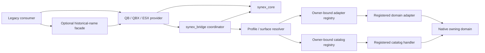

# Compatibility architecture

`synex_bridge` is a migration and interoperability boundary. It translates a reviewed subset of QB, QBX, or ESX semantics into native Synex contracts and services; it never turns legacy state into a second source of truth.

The optional facade preserves a historical resource name such as `qb-core`, `qbx_core`, or `es_extended`. It captures its immediate Cfx caller and forwards that identity once. Because it is the only trusted hop allowed to forward a consumer identity, the exact repository-owned facade is privileged trusted-computing-base code, not an interchangeable shim. The provider performs the framework-shaped projection. The coordinator owns policy, mappings, persistent compatibility identity/metadata, profiles, and bounded aggregate diagnostics. Native Synex resources remain authoritative for sessions, characters, accounts, groups, and all mutations.

## Request path

A server-side compatibility operation follows this order:

1. bind the immediate Cfx invoking resource;
2. reject a conflicting real framework resource;
3. resolve the enabled consumer, provider, profile, mode, and surface;
4. check the compatibility capability through Core delegation;
5. validate and detach every argument into a bounded canonical DTO;
6. read the active Synex session and character with a source-generation fence;
7. invoke the native Synex domain service or contract;
8. record a terminal usage outcome, latency, deprecation signal, and best-effort Core metric.

For a generic domain-adapter or catalog operation, the provider forwards the closed request to the coordinator. The coordinator resolves the exact consumer/profile/surface/operation, derives every required capability from the selected surface, performs both capability gates, and only then calls the owner-bound handler with detached context and payload DTOs. Catalog resolution additionally binds provider, domain, semantic-version range, authority, and exact revision from the profile and live registry. The consumer cannot underclaim native capabilities or select a catalog revision. There is no client-facing generic adapter or catalog endpoint.

Client input cannot select the consumer, account owner, character, source generation, group authority, or counterparty account.

## Projection model

Online projections combine:

- the active Core session and character;
- Accounts rows owned by that exact character;
- the bounded Groups compatibility snapshot;
- persistent provider-specific compatibility identity;
- explicitly mapped compatibility metadata.

The returned QB/QBX/ESX object is detached. Mutating it changes no Synex state. Its cache key includes source, session, source generation, character, local projection revision, and domain revision. Accounts and Groups events derive a character target from their bounded payload when possible and invalidate only matching projections. Missing, malformed, or conflicting identity fields fall back to global invalidation rather than retaining potentially stale state. Caching is disabled if the invalidation subscriptions cannot be bound. Mutations always go to the native domain regardless of cache state. QB and ESX stable-identifier lookups resolve only an active online session; QBX additionally supports a detached offline read model, but every method that could mutate it fails closed.

## Lifecycle and event projection

Core character activation commits one complete canonical snapshot into the selected provider shape. Each provider records the exact session/source-generation delivery fence, sends its provider-local client projection, and only then publishes the upstream-shaped public event family assigned by the coordinator. The client projection is never reconstructed from a public compatibility event. Global server events receive detached data only; callable, consumer-bound Player/xPlayer facades remain behind caller-bound server exports.

Client player data and callback invocation are separate cataloged surfaces. The server coordinator resolves bounded allowlists from active configured consumers and the normal profile/capability gates. Callback admission for QB or ESX additionally requires the same consumer to pass client player data and server callback registration; callback-only profiles are incomplete. A detached player projection is delivered only when the player-data list is non-empty, otherwise the client projection and both allowlists are cleared. Direct client exports admit their immediate Cfx resource name only when it is listed; historical client facades can forward a listed name once. This is compatibility API admission, not confidentiality or a server-trusted identity: any data delivered to a game client must remain non-sensitive, and a callback handler must authorize the player and operation again on the server.

Accounts, Groups, and mapped compatibility metadata changes drive updates. Domain events with a safe character identity refresh only matching online sources; metadata mutation queues the exact source, character, session, and source-generation fence that performed the write. The provider coalesces all topics that arrive before one zero-delay per-source refresh, rechecks the original session fence, rebuilds the canonical snapshot, and compares the detached provider data. An unchanged snapshot produces no public update. Changed snapshots publish their sorted topic set to the provider handler. Each cataloged job, gang/group, duty, or money/account update family is separately authorized, so a lifecycle grant alone does not enable those optional events. This path has bounded state and no tick loop.

QB and QBX share global `QBCore:*` event names. Their projection transports remain provider-local, while the coordinator assigns the shared QBCore family once from live resource state and successful lifecycle authorization. QB has priority; QBX is the fallback when QB is stopped, excluded, or denied. A handoff between two running eligible providers is silent for the shared family and does not fabricate an unload/load transition. QBX continues to own its distinct `qbx_core:*` group and logout events when its lifecycle path is authorized. ESX owns only the ESX family. Only provider and consumer resources in `starting` or `started` state are eligible. If no replacement exists, the delivery is suspended until an eligible consumer returns.

## Identity and database ownership

The bridge owns only `synex_compatibility_identities` and `synex_compatibility_metadata`. It does not duplicate Accounts, Groups, inventory, vehicles, or permissions. Character deletion removes both bridge-owned datasets through a Core lifecycle participant.

## Restart boundaries

Registrations are owner/epoch bound. Consumer stop removes callbacks, pending responses, temporary usage rows, warning keys, and owner registrations. Player drop cancels queued refreshes, publishes at most one fenced unload, and clears source-scoped pending work and projections. Core stop suspends retained lifecycle entries, clears cached API state, subscriptions, projections, queued refreshes, and pending callbacks, then rebinds through a bounded generation fence so a stale retry cannot replace a newer binding.

Provider startup uses a separate rehydration path. The new provider process enumerates bounded active Core sources and rebuilds its provider-local client projections with `resync = true`; provider handlers deliberately suppress public loaded events for that path, so a provider restart is not presented as a new character login. Consumer or Core unavailability instead suspends retained entries through the normal public unload path when no live authority remains and may publish the corresponding load after authority returns. These restart and failover paths are headless-tested; exact-candidate FXServer, historical-facade, mixed-provider, callback/event, and real-client acceptance remain pending.

See [security](security.md), [modes](modes.md), and the generated [surface matrix](matrix.md).
