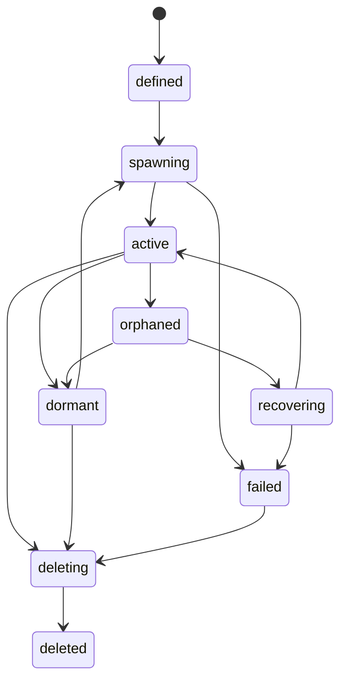

# Entity lifecycle

The durable definition lifecycle is explicit and separate from the FiveM runtime Entity.

The database constraint permits `defined`, `spawning`, `active`, `orphaned`, `recovering`, `dormant`, `deleting`, `deleted` and `failed`. Transitions use compare-and-swap versions plus the current authority lease where required. `deleted` is a tombstone with `deleted_at`; it is not a reusable active definition.

## Operation meanings

| Operation | Runtime Entity | Durable definition |
| --- | --- | --- |
| Spawn | Creates and verifies a new runtime Entity | Reserves and activates a new definition when durable policy requires one |
| Materialize | Creates and verifies a new incarnation | Retains the definition and increments generation |
| Dematerialize | Deletes the runtime Entity | Retains the definition as `dormant`; optional checkpoint first |
| Delete | Deletes the runtime Entity if present | Terminates the definition and retains its tombstone/history |
| Unexpected removal | Detaches the stale runtime mapping | Moves durable automatic-recovery definitions to `orphaned`; otherwise to `dormant` |

Temporary Entities cannot be dematerialized because they have no durable definition to retain.

## Resource lifecycle

Every runtime record carries the controlling resource and its Core lifecycle epoch. A callback from an older epoch cannot mutate a newer resource incarnation. On owner-resource stop:

- runtime Entities are removed;
- durable definitions are released as `dormant`;
- temporary/session runtime state and runtime components are cleaned;
- owned extension registrations and managed buckets are cleaned under bounded deadlines;
- cleanup failures degrade health and remain visible to diagnostics.

Persistent definitions retain their frozen archetype descriptor even though the live registration is removed. Their owner resource must register the required current schemas again before replicated extensions can be hydrated safely.

## Character lifecycle

Character unload removes materialized `temporary` and `session` Entities owned by that character. Character deletion preflight blocks while any `persistent` definition remains. The caller must explicitly transfer the logical owner or delete the persistent Entity first. When no persistent definition remains, the lifecycle participant deletes the remaining owner-lifetime, session and temporary definitions in bounded batches.

## Group lifecycle

The Entity resource registers a `group` domain-deletion provider through Core. Group deletion similarly blocks while persistent group-owned definitions remain. Remaining non-persistent definitions are removed only through the coordinated deletion action. The optional `synex_groups@1` service is used to validate a group owner when it is assigned.

Neither lifecycle silently rewrites a durable owner into a generic retained identity.

## Events and hooks

The resource publishes lifecycle events for created, materialized, dematerialized, orphaned, recovered, owner-changed, bucket-changed and deleted outcomes. Explicit caller operations run Core-owned pre-operation hooks before spawn, delete, checkpoint, logical-owner change, bucket move and recovery.

Hooks are policy extension points, not authorization. Capability, caller epoch, ownership, generation, database version and authority-lease checks still run at the Entity boundary.

Mandatory cleanup after resource stop, character/group deletion coordination, authority loss or unexpected native removal cannot be blocked by an extension veto. Those paths remain bounded and fenced, and attempt bounded Core event/audit publication for the actual `dematerialized`, `orphaned` or `deleted` outcome instead of reporting only a generic cleanup action. Publication is best effort; failure degrades health as `OBSERVABILITY_UNAVAILABLE` but does not roll back an already committed cleanup transition.
