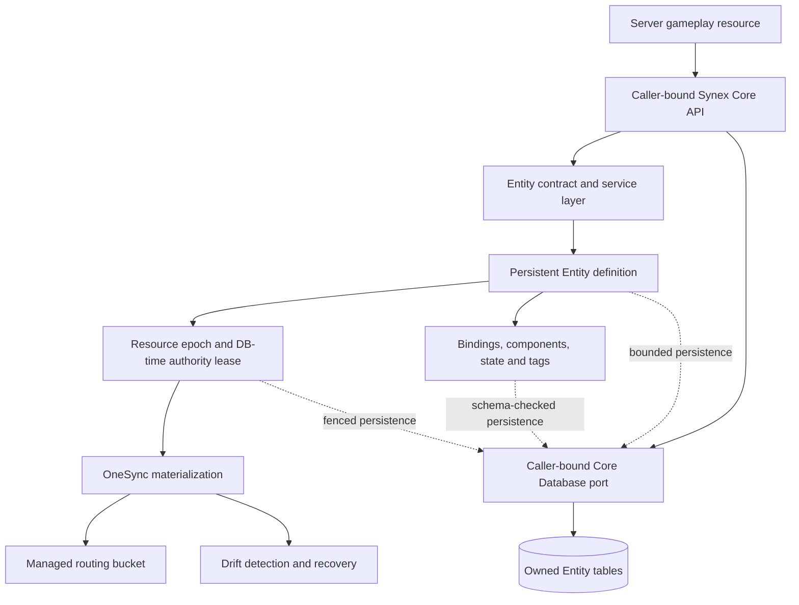

# Entity Authority Engine

> [!WARNING]
> `synex_entities` is **Development / Experimental Alpha**. The implementation, contracts, migrations and repository tests are present, but the current candidate has not completed a fresh MariaDB, live FXServer/OneSync, restart/recovery and real-client acceptance run. It is outside the frozen `synex_core` Production-Beta boundary.

`synex_entities` is the server-authoritative foundation for Synex-managed FiveM network entities. It manages technical identity, materialization, runtime mapping, routing, persistence, recovery and resource ownership for:

- vehicles;
- peds that are not player peds;
- objects.

It does not own vehicle registration, fuel, inventory, jobs, interactions, housing, MLOs, zones, doors or other gameplay meaning. A domain resource retains those facts and may bind one of its records to a managed runtime Entity.

## Implemented boundary

The current source implements:

- opaque stable Entity IDs and generation-fenced `EntityRef` values;
- reverse indexes for Entity ID, runtime handle, NetID, binding, resource owner, logical owner and bucket;
- server-side vehicle, ped and object creation followed by runtime verification;
- durable definitions that can remain valid while no FiveM Entity exists;
- namespaced persistent keys and unique active domain bindings;
- registered archetypes, component schemas and state schemas;
- runtime, persistent and replicated component modes;
- explicit checkpoints and controlled state-bag projection;
- generation-fenced managed routing buckets with owner, capacity, policy and expiry;
- database-time authority leases, recovery history, backoff and a recovery circuit;
- paged drift reconciliation, query surfaces, health, metrics, audit and diagnostics;
- Character and Group deletion participation through Core lifecycle coordinators;
- a read-only Entity projection in `synex_control`.

All public Entity contracts are server-only (`network: none`). A gameplay client must call its own validated server boundary; the server resource then invokes the Entity contract through Core.

## Architecture rules

1. An Entity ID is durable; a NetID and game handle are not.
2. Every stable runtime reference contains both Entity ID and generation.
3. Network ownership is transport state, never authorization.
4. The immediate Core caller is the resource principal. Payloads cannot select their own resource authority.
5. Resource ownership, logical ownership and instance authority are independent.
6. Persistence and materialization are independent.
7. A domain binding identifies the external domain record; it does not move that record into the Entity domain.
8. Every mutation is bounded, capability-gated and serialized through a resource or Entity operation lane.
9. Global OneSync and state-bag ConVars are observed by diagnostics, never changed by the resource.

## Documentation map

- [Identity and generation safety](identity.md)
- [Lifecycle](lifecycle.md)
- [Materialization](materialization.md)
- [Persistence and checkpoints](persistence.md)
- [Domain bindings](bindings.md)
- [Ownership](ownership.md)
- [Components](components.md)
- [Entity state](state.md)
- [Routing buckets](routing-buckets.md)
- [Recovery and drift](recovery.md)
- [Cluster authority](cluster-authority.md)
- [Security](security.md)
- [Resource development](development.md)
- [Contract catalog and configuration](../reference/entities.md)

## Operational metrics

Core prefixes Entity metric names with `synex_entities_`. The stable suffixes are
`entity_live_total`, `entity_spawn_total`, `entity_spawn_duration`,
`entity_delete_total`, `entity_delete_failures`, `entity_orphaned_total`,
`entity_recovered_total`, `entity_recovery_failed_total`,
`entity_generation_changes`, `entity_component_count`, `bucket_live_total`,
`bucket_player_count`, `bucket_entity_count`, `quota_denials`,
`spawn_rate_denials`, `drift_findings` and `authority_lease_conflicts`.
Legacy `_total` denial counters and the millisecond-suffixed duration series remain
available for compatibility; the unsuffixed names above are the stable Entity
observability surface.

Core's bounded metric registry is the operator-facing source of truth and exposes duration histograms as p50/p95/p99 snapshots. The Entity resource updates its local last-value cache only after Core accepts the write. A rejected metric publication degrades Entity health with `OBSERVABILITY_UNAVAILABLE` rather than presenting stale local values as current evidence.

## Maturity boundary

Repository tests and local Lua benchmarks are regression evidence, not runtime acceptance or production-performance evidence. Promotion requires an exact candidate to pass fresh migrations, OneSync startup, real vehicle/ped/object lifecycle cases, restart and authority takeover, recovery failure injection, routing-bucket client cases, resource cleanup, NetID reuse and the Control CEF smoke test. See [Testing](../testing.md) and [Release readiness](../release-readiness.md).
