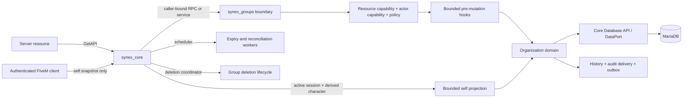

# Synex Organizations Engine

> [!WARNING]
> `synex_groups` is **Experimental Alpha**. Its uncommitted working tree passed repository, disposable-MariaDB, isolated-FXServer, live-restart, and Doctor checks on 2026-08-25. The manual client self-snapshot smoke, exact committed-revision review, and explicit owner maturity/publication decision remain open. It remains outside the accepted `synex_core` Production-Beta profile and has no production-readiness, support, publication, or stable-API decision.

`synex_groups` is the server-authoritative organization domain for Synex. It models organizations, memberships, hierarchy, grades, roles, scoped capabilities, delegations, duty sessions, assignments, applications, approvals, relationships, typed attributes, and static definitions without embedding gameplay-specific behavior.

The ownership rule is deliberately one-way:

> Gameplay resources use `synex_groups`; `synex_groups` does not know gameplay resources.

Police, medical, business, crew, family, faction, and player-created systems can share one organization model while retaining their own account, inventory, vehicle, world, interaction, notification, and UI logic.

## Current boundary

The current Alpha boundary is:

- server-authoritative, with `synex_core` as its only direct runtime dependency;
- declared non-critical (`critical: false`) in its resource manifest;
- contract-first, with 71 public `synex.groups.*` RPC contracts marked `experimental`;
- composed of 70 server-local contracts (`network: none`) plus the single authenticated client projection `synex.groups.self.snapshot` (`network: client-to-server`);
- callable from server resources through Core's caller-bound RPC surface or, for the 70 server-local methods, the versioned `synex.groups@1` service;
- protected by Core resource capabilities and, where an actor is involved, character authority inside the target group;
- offline-first: memberships and authority are durable character state, not player-source state;
- relational and transactional, with optimistic versions, command receipts, domain history, audit delivery, and durable outbox intent;
- connected to MariaDB exclusively through the bounded Synex Core Database API/DataPort, not through a direct `oxmysql` dependency;
- generation-fenced and fail-closed while its Core registrations are incomplete or unavailable;
- independent from `synex_accounts`, payroll, inventory, vehicles, world state, interactions, notifications, bridges, and NUI.

There is no client mutation, management NetEvent, NUI, payroll engine, shared account, garage, job gameplay, or framework-compatibility layer in this resource. The only client-visible operation is the bounded, read-only self snapshot described below.

## Architecture

Groups-owned tables are implementation details. Integrations use the generated contracts, the versioned service, or durable domain events.

### Core binding lifecycle

Groups uses a resumable registration coordinator rather than exposing a partially bound API. Each Core binding generation becomes ready only after the deletion provider, character-lifecycle participant, `synex.groups@1` service, all 71 RPCs, and five scheduler workers are registered. The service begins `UNHEALTHY`; public handlers and workers remain guarded until the complete barrier succeeds.

Retryable attempts retain a progress journal and token-aware scheduler ownership, so rollback cancels only registrations from the matching attempt and already completed work is not duplicated. Exhausted retryable failures schedule another generation-fenced recovery cycle after five seconds. Non-retryable failures are terminal and fail-closed for that generation. On Core stop, the generation, current API reference, and readiness state are fenced immediately before yielding cleanup can run.

Automated rebind regressions cover interrupted registration and Core stop/start behavior. The 2026-08-25 working-tree run added live MariaDB, fresh isolated FXServer, Groups/Core restart, and Doctor evidence for the expanded surface. It did not run a FiveM client or certify bytes changed by a later commit.

### Extension-registry synchronization

Every resource that owns group types, relation types, duty states, or attribute schemas must start each resource epoch with `synex.groups.registries.begin` before it submits any registration—even when the desired set is empty. The caller reuses one start-scoped `idempotency_key` for retries during that epoch and uses a new key after the resource restarts. The begin transaction advances the owner's synchronization generation and disables the previously active owned set; following registrations rebuild the desired set under the exact current Core owner epoch.

The four registration contracts reject callers without a current active synchronization session. Registry hydration joins only active definitions whose stored owner epoch matches that session. Resource-stop cleanup tombstones the exact stopped epoch before removing its in-memory entries, so a delayed callback or stale stop cannot reactivate or delete a newer owner's registrations. This is a complete-set startup protocol, not an optional cleanup hint.

## Implemented surface

The current contract catalog covers:

- dynamic organization creation, type-specific creation permissions and approval quorums;
- atomic slug reservations across live groups and pending creation requests;
- bounded organization reads, updates, hierarchy, archive, and coordinated deletion;
- memberships, invitations, applications, grades, roles, reporting, and primary membership by group type;
- group-, grade-, role-, membership-, and delegation-based capability evaluation;
- stored contextual policies and configurable membership-transition policies;
- duty sessions and bounded duty reads;
- assignments with bounded detail/list reads;
- relationship types and expiry-aware relationship detail/list reads;
- proposals and approval workflows;
- owner-bound group types, duty states, relation types, and attribute schemas;
- typed, visibility-controlled membership attributes with global or group-type scope;
- owner-bound static definition materialization, drift detection, and reconciliation;
- bounded directory, history, and Doctor reads;
- exact, read-only compatibility target resolution plus an approval-, policy-, idempotency-, and CAS-bound atomic grade/primary mutation;
- one active-session-bound self snapshot containing only the caller's memberships, public group/grade/role data, and own duty state.

The current source catalog contains **71 Groups contracts**: 70 server-local contracts and one client-to-server self projection. Across the repository's nine source catalogs there are currently 204 versioned definitions. Treat those counts as revision-specific; the exact source remains the [generated contract catalog](../../packages/contracts/generated/docs/contracts.md), and the concise cross-resource reference is [Groups API reference](../reference/groups.md).

All Groups reads pass a final encoded-response guard of 30,000 bytes, below Core's 32 KiB RPC/service ceiling. The relationship, duty, and assignment list contracts cap pages at 40; the self projection caps memberships and per-membership roles at 8; other management lists retain their contract-declared limits of at most 100. Relationship and assignment detail metadata is additionally bounded to 16 KiB. A response that cannot fit fails with `READ_MODEL_TOO_LARGE` instead of crossing the transport boundary partially.

## Modeling examples

These are compositions of the implemented Organizations Engine, not bundled gameplay resources:

- An LSPD-style domain can model the department as an organization, divisions as child organizations, ranks as grades, qualifications as roles or typed attributes, supervisors through reporting edges, shifts through duty sessions, and calls through assignments. Weapons, vehicles, dispatch, payroll, and world interactions remain in their owning resources.
- A business-style domain can model owner/manager/staff authority with grades and roles, delegate bounded capabilities, control directory visibility, and accept membership applications. Money remains in `synex_accounts`; shops, inventory, property, UI, and employee gameplay remain outside Groups.

Both examples use the same server-authoritative contracts, actor authorization, optimistic versions, idempotency, and durable events. The self snapshot may present only the connected character's own public projection; all management and mutation work remains server-local. Neither example introduces a special-case police or business code path inside `synex_groups`.

## Runtime index

The resource maintains bounded in-memory maps for connected characters, online memberships, open duty sessions, and on-duty group membership. Startup rebuilds the index from one bounded player snapshot and durable Groups state. Character lifecycle events, committed Groups effects, owner restarts, group invalidation, and resource stop refresh or clear it.

The index is an optimization only. Persistent membership, duty, and capability decisions remain database-authoritative. The public API does not expose the internal index as an authority bypass; Doctor reports only bounded counters and sizes.

Capability and stored-policy definitions use a separate bounded cache keyed by their durable definition revision. A cache hit never replaces the database revision check, and group mutations invalidate affected definition entries. `synex.groups.doctor` exposes its bounded counters under `cache.definitions`; those metrics are diagnostics, not authorization state.

## Client self projection

`synex.groups.self.snapshot` is the sole `client-to-server` Groups contract. Core accepts it only for an `ACTIVE` session and supplies the authoritative character ID from that session; the request schema accepts only an optional cursor and a limit of at most 8. Attempts to submit a character ID or another undeclared field are rejected.

The response is limited to the connected character's own memberships, public group identity, public grade and role identity, and their own open duty state. It does not return other members, membership attributes, capability traces, policies, audit/history data, or management metadata. Core applies a per-session contract bucket with capacity 4 and refill rate 1 request per second.

## Maturity and acceptance

The previous Alpha baseline cannot be used as acceptance evidence for the current 71-contract, 31-migration revision. The historical working-tree gate below predates migration `032` and is retained only as earlier evidence:

| Gate | Current revision |
| --- | --- |
| Repository suite | PASS — `npm run check`; 644/668 passed with 24 expected live-DB skips; focused Groups 197/197; security 174/0; audit 0 |
| Real Lua benchmark | PASS — six production Lua hot paths under local-regression thresholds; excludes FXServer, networking, and MariaDB performance |
| Disposable MariaDB | PASS — 96/96 live tests, 0 skipped |
| Isolated FXServer | PASS — Core 27/27 plus Groups 30/30 migrations, Core `READY`, both resources `HEALTHY` |
| Groups and Core restart | PASS — Groups owner epoch advanced; expected dependency stop after Core restart; `ensure synex_groups` restored both resources to `HEALTHY` |
| Diagnostics | PASS — Doctor returned `PASS` after fresh boot and after restart recovery |
| Client self snapshot | **PENDING** — manual live active-session and reconnect smoke test not run |
| Candidate closure | **PENDING** — exact committed-revision diff/secret review and explicit owner maturity/support/publication decision |

The passed rows describe only the uncommitted working tree tested on 2026-08-25. They must not be reused after runtime bytes change and do not certify the future committed candidate. Completing the remaining rows would still not make Groups part of the frozen Core Production-Beta profile, certify production deployment, guarantee compatibility, or stabilize contracts and migrations. Publication, upgrade policy, a supported deployment profile, and the explicit owner decision remain separate gates before any broader maturity claim.

## Documentation map

- [Groups and group types](groups.md)
- [Memberships](memberships.md)
- [Grades and roles](grades-and-roles.md)
- [Capabilities](capabilities.md)
- [Policies](policies.md)
- [Duty](duty.md)
- [Assignments](assignments.md)
- [Delegations](delegations.md)
- [Applications, proposals, and creation approvals](approvals.md)
- [Relationships](relationships.md)
- [Custom group types and definitions](custom-group-types.md)
- [Resource development](development.md)
