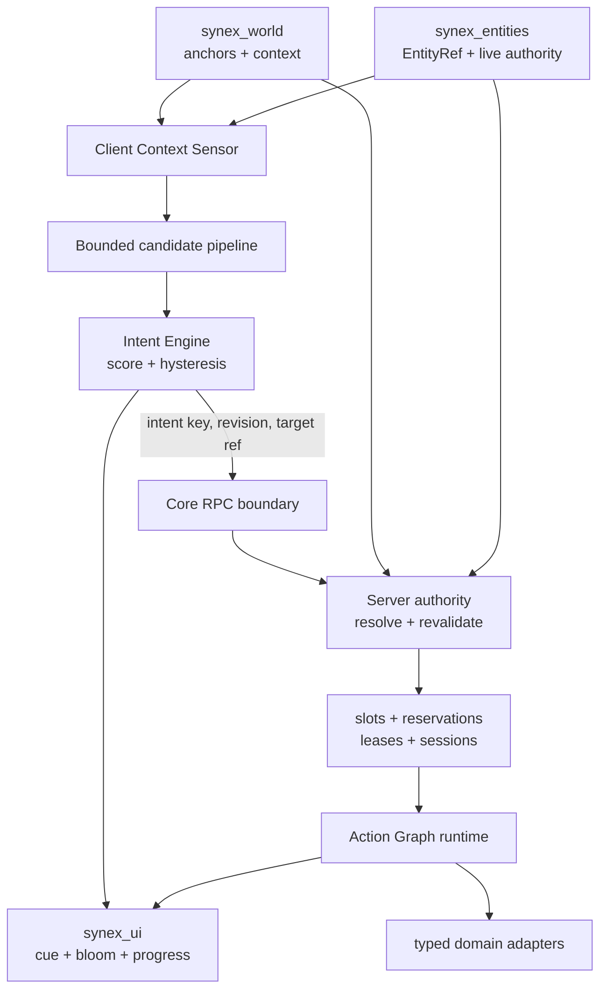

# Interact architecture

## Client observation plane

The client reads one actor/camera sample, a bounded World slice and locally relevant definitions. Static bindings are indexed into spatial cells; entity and provider candidates are admitted through bounded paths. At most a small expensive subset is considered for asynchronous line-of-sight work. The resulting `InteractionContext` is marked `OBSERVED` and is useful only for discovery and presentation.

Definition discovery is transferred in deterministic registry order through revision-fenced, UTF-8-safe string chunks below the Core transport ceiling. The client accumulates the bounded transfer separately from the live indexes for at most ten seconds. It swaps the complete set atomically only when every page carries consistent metadata and the full payload decodes within the object/byte bounds; stale, missing, oversized or malformed transfers are discarded without partial activation.

The Intent Engine scores relevant intents, applies deterministic tie-breaking, continuity, a switch threshold and minimum dwell, then projects one primary intent plus bounded alternatives. `synex_ui` renders that projection; it does not approve gameplay.

## Server authority plane

The client sends only an intent identity/revision, target reference, optional slot key and discovery revision. Core supplies the active session, source generation and RPC caller context. Interact reserves active-plus-in-flight admission capacity before any yielding validation, resolves canonical bundle data, checks the owner epoch, revalidates the actor, target, World/Entity revision, distance, policy and rate budget, then reacquires actor, definition, target and World evidence immediately before publishing the session, reservation and short-lived lease.

Activation changes an issued lease to `ACTIVATING` and destroys its nonce before the first potentially yielding target, policy or availability call. Concurrent replay therefore cannot pass the preflight window. The runtime repeats the changing checks, reacquires post-yield authority and only then marks that participant ready. The final required participant atomically occupies the session-wide multi-slot reservation, claims actor locks and starts the compiled graph.

Additional participants require a one-time invitation issued by the owning resource. It is bound to the exact session, role, source, source generation, Core session identity and owner epoch; join consumes it only after current authority has been reacquired. Before every `commit` node, a mandatory runtime guard independently rechecks the running execution, all ready participants, active leases, occupied reservations, actor locks, current Core sessions, policy, availability and canonical target/World evidence. The typed adapter is never invoked when that guard fails. Typed adapters remain the only extension point for domain side effects.

## Lifecycle plane

Definitions and extensions are owned by resource plus owner epoch. Bundle replacement or owner stop revokes affected leases/sessions and removes registry entries. Player drop cleans source-generation-bound runtime state. Core or Interact restart invalidates the old incarnation instead of allowing stale callbacks or references to continue.

## Operations plane

The resource exposes bounded summary, health, list, inspect, metrics and findings views through a `synex_control` provider. Rejected manifest-declared bundles remain in a bounded process-local diagnostic set until their path activates cleanly or the owner/path disappears, so compiler and dependency failures do not vanish after bootstrap. Client telemetry is validated as bounded aggregate evidence and exposed only as an informational advisory; it cannot by itself degrade server health. Denial history and traces are process-local and capped. They are debugging signals, not durable audit or acceptance evidence.

The Smart Object inspector combines the compiled definition with current slot usage and redacted lease/actor counts. It never returns player sources, character IDs or internal actor keys. The graph inspector returns at most 32 active execution details per graph: current node, elapsed time, participant role counts, lock channels, redacted lease state and commit state. Truncation and scan-completeness flags remain explicit.
