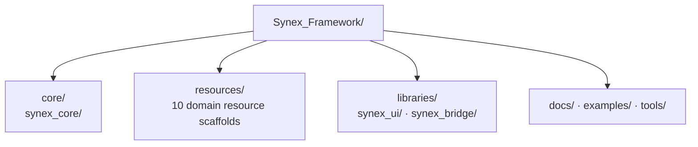

<p align="center">
  
</p>

<h1 align="center">Synex</h1>

<p align="center">
  <strong>Eine bewusst konzipierte Grundlage für ein modulares FiveM-Framework und ein zusammenhängendes Ökosystem aus eigenen Resources.</strong>
</p>

<p align="center">
  <sub>DOCUMENTATION LANGUAGE</sub><br>
  <a href="../../../README.md">EN</a>
  &nbsp;·&nbsp;
  <strong>DE</strong>
  &nbsp;·&nbsp;
  <a href="../fr/README.md">FR</a>
  &nbsp;·&nbsp;
  <a href="../es/README.md">ES</a>
  &nbsp;·&nbsp;
  <a href="../pt-BR/README.md">PT-BR</a>
</p>

<p align="center">
  Synex wird als einheitliches Framework mit klar abgegrenzten Verantwortlichkeiten für Core, Domain-Resources und gemeinsam genutzte Libraries aufgebaut.<br>
  Das Repository bildet derzeit ein Foundation-Scaffold: Seine Grenzen sind angelegt; Runtime-Code ist nicht Bestandteil des aktuellen Repositories.
</p>

<p align="center">
  <a href="#warum-synex">Warum Synex</a> ·
  <a href="#geplantes-ökosystem">Ökosystem</a> ·
  <a href="#repository-architektur">Architektur</a> ·
  <a href="#erste-schritte">Erste Schritte</a> ·
  <a href="#entwicklungsstatus">Status</a>
</p>

<p align="center">
  
  
</p>

<p align="center">
  
</p>

> [!IMPORTANT]
> **Aktueller Reifegrad:** Synex befindet sich in der Repository-Foundation-Phase. Die unten dokumentierten Modulgrenzen existieren, allerdings wurden bislang weder lauffähige FiveM-Resources noch Manifeste, Runtime-Code, ein Datenbankschema, eine Konfiguration oder ein Installationsablauf committed.

## Warum Synex

Ein Framework-Ökosystem beginnt mit expliziten Verantwortlichkeiten. Synex legt diese Grenzen fest, bevor Implementierungsdetails als Produktfunktionen dargestellt werden.

- **Grenzen als Ausgangspunkt.** Core, Domain-Resources, gemeinsam genutzte Libraries, Dokumentation, Beispiele und Tools sind jeweils in eigenen Bereichen verortet.
- **Einheitlicher Namespace.** Jedes reservierte Framework-Modul verwendet das Präfix `synex_`.
- **Domain-orientiertes Ökosystem.** Charaktere, Wirtschaft, Kommunikation und Fahrzeuge werden durch eigenständige Resource-Scaffolds repräsentiert.
- **Nachweisbasierter Reifegrad.** Ein Verzeichnis kennzeichnet eine vorgesehene Verantwortlichkeit; es wird nicht als fertige oder installierbare Funktion dargestellt.

## Foundation-Modell

| Bereich | Vorgesehene Verantwortlichkeit | Stand heute nachgewiesen |
| --- | --- | --- |
| `core/` | Bereich des Framework-Cores | `synex_core`-Scaffold |
| `resources/` | Eigene Domain-Resources | 10 benannte Scaffolds |
| `libraries/` | Gemeinsam genutzte Framework-Libraries | `synex_ui`- und `synex_bridge`-Scaffolds |
| `docs/`, `examples/`, `tools/` | Projektleitfäden, Beispiele und Tools | Lokalisierte README-Struktur; `examples/` und `tools/` reserviert |

Die Struktur legt ausschließlich die Verantwortlichkeiten innerhalb des Repositories fest. Sie definiert noch keine Runtime-Dependencies, öffentlichen Verträge, Client-/Server-Grenzen oder das Verhalten von Services.

## Geplantes Ökosystem

Jeder nachfolgende Eintrag hat derzeit denselben nachgewiesenen Status: **Scaffold** — das Verzeichnis existiert, enthält aber weder ein Resource-Manifest noch eine Implementierung. Die Beschreibungen benennen reservierte Verantwortlichkeiten, keine verfügbaren Funktionen.

| Bereich | Modul | Reservierte Verantwortlichkeit |
| --- | --- | --- |
| Foundation | [`synex_core`](../../../core/synex_core/) | Reservierter Bereich für den Framework-Core |
| Foundation | [`synex_ui`](../../../libraries/synex_ui/) | Reservierter Bereich für die gemeinsam genutzte UI-Library |
| Foundation | [`synex_bridge`](../../../libraries/synex_bridge/) | Reservierter Bereich für die Integrations-Bridge |
| Player | [`synex_character`](../../../resources/synex_character/) | Reservierter Bereich für die Character-Domain |
| Player | [`synex_identity`](../../../resources/synex_identity/) | Reservierter Bereich für die Identity-Domain |
| Player | [`synex_inventory`](../../../resources/synex_inventory/) | Reservierter Bereich für die Inventory-Domain |
| Wirtschaft | [`synex_banking`](../../../resources/synex_banking/) | Reservierter Bereich für die Banking-Domain |
| Wirtschaft | [`synex_jobs`](../../../resources/synex_jobs/) | Reservierter Bereich für die Jobs-Domain |
| Wirtschaft | [`synex_shops`](../../../resources/synex_shops/) | Reservierter Bereich für die Shops-Domain |
| Kommunikation | [`synex_phone`](../../../resources/synex_phone/) | Reservierter Bereich für die Phone-Domain |
| Kommunikation | [`synex_radio`](../../../resources/synex_radio/) | Reservierter Bereich für die Radio-Domain |
| Mobilität | [`synex_vehicles`](../../../resources/synex_vehicles/) | Reservierter Bereich für die Vehicle-Domain |
| Mobilität | [`synex_garages`](../../../resources/synex_garages/) | Reservierter Bereich für die Garage-Domain |

## Repository-Architektur

Dieses Diagramm stellt das aktuelle Framework-Scaffold dar. Es ist bewusst eine Übersicht des Repositories und kein Runtime-Dependency-Graph.



Die Pfeile kennzeichnen ausschließlich die Platzierung auf der obersten Repository-Ebene. Sie implizieren weder Dependency-Richtung noch Event-Flow, Callback-Layer, Player-Service, Datenbank-Layer oder NUI-Interaktion.

## Aktuell erkennbare Designprinzipien

- **Verantwortlichkeiten im Namespace.** Framework-eigene Modulverzeichnisse teilen sich das Präfix `synex_`.
- **Getrennte Zuständigkeiten.** Core, Resources, wiederverwendbare Libraries und Bereiche für die Projektunterstützung sind auf oberster Ebene voneinander getrennt.
- **Eine Domain pro Scaffold.** Jede geplante Resource besitzt ein eigenständig abgegrenztes Verzeichnis.
- **Aussagen folgen der Implementierung.** APIs, Performance-Eigenschaften, Sicherheitsgarantien und Kompatibilität werden erst dokumentiert, wenn sie anhand von Repository-Artefakten verifiziert werden können.

## Erste Schritte

> [!NOTE]
> **Die Installationsdokumentation wird derzeit vorbereitet.**

Es gibt noch keinen verifizierten Installationsweg: Das Repository enthält derzeit weder eine `fxmanifest.lua` noch eine Dependency-Definition, Konfiguration, ein Datenbankschema oder eine Startreihenfolge für Resources. Befehle werden erst veröffentlicht, sobald sie anhand lauffähiger Resources getestet werden können.

## Repository-Struktur

<details>
<summary>Aktuelle Struktur auf oberster Ebene anzeigen</summary>

```text
Synex_Framework/
├── .gitattributes
├── .github/
│   └── assets/
│       ├── branding/
│       │   ├── synex-mark.svg
│       │   ├── synex-mark.png
│       │   ├── synex-mark-512.png
│       │   ├── synex-mark-256.png
│       │   ├── synex-mark-128.png
│       │   └── synex-mark-animated.gif
│       └── readme/
│           └── hero.webp
├── .gitignore
├── core/
│   └── synex_core/
├── resources/
│   ├── synex_character/
│   ├── synex_identity/
│   ├── synex_inventory/
│   ├── synex_banking/
│   ├── synex_phone/
│   ├── synex_radio/
│   ├── synex_jobs/
│   ├── synex_shops/
│   ├── synex_vehicles/
│   └── synex_garages/
├── libraries/
│   ├── synex_ui/
│   └── synex_bridge/
├── tools/
├── docs/
│   └── locales/
│       ├── README.md
│       ├── de/README.md
│       ├── fr/README.md
│       ├── es/README.md
│       └── pt-BR/README.md
├── examples/
└── README.md
```

Die Modulverzeichnisse enthalten derzeit ausschließlich `.gitkeep`-Platzhalter.

</details>

## Technologiestatus

FiveM ist die deklarierte Zielplattform. Runtime-Sprache, NUI-Stack, Datenbank-Engine, Package-Manager und Build-Pipeline lassen sich aus dem aktuellen Inhalt des Repositories noch nicht bestimmen.

## Entwicklungsstatus

| Bereich | Nachgewiesener Status |
| --- | --- |
| Repository-Organisation | Vorhanden |
| Core-, Resource- und Library-Module | Nur Verzeichnis-Scaffolds |
| Resource-Manifeste und Runtime-Code | Nicht vorhanden |
| Öffentliche APIs, Events, Exports und Callbacks | Nicht vorhanden |
| Datenbank-, Konfigurations-, Berechtigungs- und Sicherheitssysteme | Nicht vorhanden |
| Installationsablauf und detaillierte Leitfäden | Nicht verfügbar |
| Lizenz | Nicht deklariert |

## Dokumentation

Die lokalisierten Versionen dieser Landing Page sind im [Locale-Index](../README.md) aufgeführt. Leitfäden auf Grundlage einer Implementierung wurden noch nicht veröffentlicht.

---

<p align="center">
  <sub>Synex Framework · Zuerst klare Grenzen. Als Nächstes verifizierte Funktionen.</sub>
</p>
