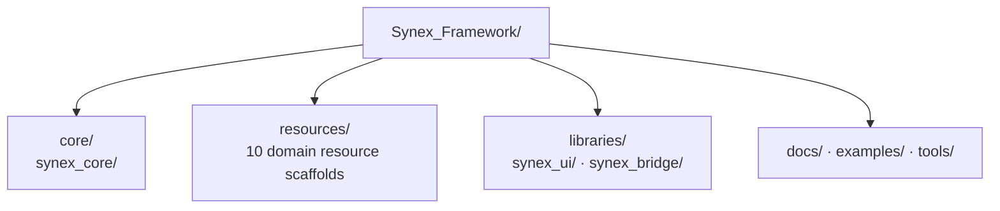

<p align="center">
  
</p>

<h1 align="center">Synex</h1>

<p align="center">
  <strong>Una base concebida para un framework modular de FiveM y un ecosistema coherente de Resources propias.</strong>
</p>

<p align="center">
  <sub>DOCUMENTATION LANGUAGE</sub><br>
  <a href="../../../README.md">EN</a>
  &nbsp;·&nbsp;
  <a href="../de/README.md">DE</a>
  &nbsp;·&nbsp;
  <a href="../fr/README.md">FR</a>
  &nbsp;·&nbsp;
  <strong>ES</strong>
  &nbsp;·&nbsp;
  <a href="../pt-BR/README.md">PT-BR</a>
</p>

<p align="center">
  Synex se está estructurando como un único framework, con responsabilidades claramente delimitadas entre su Core, sus Resources de dominio y sus bibliotecas compartidas.<br>
  El repositorio se encuentra actualmente en su fase fundacional: sus límites están definidos, pero el código de Runtime aún no forma parte de él.
</p>

<p align="center">
  <a href="#por-qué-synex">Por qué Synex</a> ·
  <a href="#ecosistema-planificado">Ecosistema</a> ·
  <a href="#arquitectura-del-repositorio">Arquitectura</a> ·
  <a href="#primeros-pasos">Primeros pasos</a> ·
  <a href="#estado-de-desarrollo">Estado</a>
</p>

<p align="center">
  
  
</p>

<p align="center">
  
</p>

> [!IMPORTANT]
> **Madurez actual:** Synex se encuentra en la fase fundacional del repositorio. Los límites de los módulos que se documentan a continuación existen, pero todavía no se han incorporado Resources de FiveM ejecutables, manifiestos, código de Runtime, esquemas de base de datos, configuración ni un flujo de instalación.

## Por qué Synex

La base de un ecosistema de framework es una asignación explícita de responsabilidades. Synex establece esos límites antes de presentar detalles de implementación como capacidades del producto.

- **Límites como punto de partida.** El Core, las Resources de dominio, las bibliotecas compartidas, la documentación, los ejemplos y las herramientas tienen ubicaciones independientes.
- **Namespace coherente.** Todos los módulos reservados del framework utilizan el prefijo `synex_`.
- **Ecosistema orientado a dominios.** Los ámbitos de personajes, economía, comunicación y vehículos están representados por estructuras base de Resources independientes.
- **Madurez respaldada por evidencias.** Un directorio indica la responsabilidad prevista; no se presenta como una funcionalidad terminada ni instalable.

## Modelo fundacional

| Límite | Responsabilidad prevista | Verificado actualmente |
| --- | --- | --- |
| `core/` | Ubicación del Core del framework | Estructura base de `synex_core` |
| `resources/` | Resources de dominio propias | 10 estructuras base con nombre definido |
| `libraries/` | Bibliotecas compartidas del framework | Estructuras base de `synex_ui` y `synex_bridge` |
| `docs/`, `examples/`, `tools/` | Documentación del proyecto, ejemplos y herramientas | README localizados y guía de integración de Discord; ejemplos y herramientas reservados |

La estructura establece únicamente la asignación de responsabilidades dentro del repositorio. Todavía no establece dependencias de Runtime, contratos públicos, límites entre Client y Server ni el comportamiento de los servicios.

## Ecosistema planificado

Todas las entradas siguientes tienen actualmente el mismo estado verificado: **Estructura base** — el directorio existe, pero no contiene ningún manifiesto de Resource ni implementación. Las descripciones indican responsabilidades reservadas, no funcionalidades disponibles.

| Área | Módulo | Responsabilidad reservada |
| --- | --- | --- |
| Base | [`synex_core`](../../../core/synex_core/) | Límite del Core del framework |
| Base | [`synex_ui`](../../../libraries/synex_ui/) | Límite de la biblioteca de UI compartida |
| Base | [`synex_bridge`](../../../libraries/synex_bridge/) | Límite del Bridge de integración |
| Jugador | [`synex_character`](../../../resources/synex_character/) | Límite del dominio de personajes |
| Jugador | [`synex_identity`](../../../resources/synex_identity/) | Límite del dominio de identidad |
| Jugador | [`synex_inventory`](../../../resources/synex_inventory/) | Límite del dominio de inventario |
| Economía | [`synex_banking`](../../../resources/synex_banking/) | Límite del dominio bancario |
| Economía | [`synex_jobs`](../../../resources/synex_jobs/) | Límite del dominio de empleos |
| Economía | [`synex_shops`](../../../resources/synex_shops/) | Límite del dominio de tiendas |
| Comunicación | [`synex_phone`](../../../resources/synex_phone/) | Límite del dominio de telefonía |
| Comunicación | [`synex_radio`](../../../resources/synex_radio/) | Límite del dominio de radio |
| Movilidad | [`synex_vehicles`](../../../resources/synex_vehicles/) | Límite del dominio de vehículos |
| Movilidad | [`synex_garages`](../../../resources/synex_garages/) | Límite del dominio de garajes |

## Arquitectura del repositorio

Este diagrama representa la estructura base actual del framework. Se trata deliberadamente de un mapa del repositorio, no de un grafo de dependencias de Runtime.



Las flechas indican únicamente la ubicación en el nivel superior del repositorio. No implican ninguna dirección de dependencias, ningún flujo de eventos, ninguna capa de callbacks, ningún servicio de jugadores, ninguna capa de base de datos ni ninguna interacción NUI.

## Principios de diseño visibles actualmente

- **Responsabilidad dentro del namespace.** Los directorios de módulos propiedad del framework comparten el prefijo `synex_`.
- **Separación de responsabilidades.** El Core, las Resources, las bibliotecas reutilizables y el soporte del proyecto ocupan áreas de primer nivel distintas.
- **Un dominio por estructura base.** Cada Resource planificada dispone de un límite de directorio independiente.
- **Las afirmaciones siguen a la implementación.** Las API, las características de rendimiento, las garantías de seguridad y la compatibilidad solo se documentarán cuando puedan verificarse en los artefactos del repositorio.

## Primeros pasos

> [!NOTE]
> **La documentación de instalación está en preparación.**

Todavía no existe un procedimiento de instalación verificado: el repositorio no contiene actualmente ningún `fxmanifest.lua`, definición de dependencias, configuración, esquema de base de datos ni orden de inicio de Resources. Los comandos solo se publicarán cuando puedan probarse con Resources ejecutables.

## Estructura del repositorio

<details>
<summary>Ver la estructura actual de nivel superior</summary>

```text
Synex_Framework/
├── .gitattributes
├── .github/
│   ├── assets/
│   │   ├── branding/
│   │   └── readme/
│   ├── scripts/
│   │   └── discord/
│   └── workflows/
├── .gitignore
├── core/
│   └── synex_core/
├── resources/
│   ├── synex_character/
│   ├── synex_identity/
│   ├── synex_inventory/
│   ├── synex_banking/
│   ├── synex_phone/
│   ├── synex_radio/
│   ├── synex_jobs/
│   ├── synex_shops/
│   ├── synex_vehicles/
│   └── synex_garages/
├── libraries/
│   ├── synex_ui/
│   └── synex_bridge/
├── tools/
├── docs/
│   ├── discord-notifications.md
│   └── locales/
│       ├── README.md
│       ├── de/README.md
│       ├── fr/README.md
│       ├── es/README.md
│       └── pt-BR/README.md
├── examples/
└── README.md
```

Actualmente, los directorios de módulos solo contienen archivos `.gitkeep` como marcadores.

</details>

## Estado tecnológico

FiveM es la plataforma de destino declarada. La automatización del repositorio utiliza módulos JavaScript sin dependencias sobre Node.js 24 mediante GitHub Actions. A partir del contenido actual todavía no es posible determinar el lenguaje de Runtime del framework, el stack NUI, el motor de base de datos, el gestor de paquetes ni el pipeline de build de Resources.

## Estado de desarrollo

| Área | Estado verificado |
| --- | --- |
| Organización del repositorio | Presente |
| Feed de desarrollo de GitHub a Discord | Implementado y cubierto por las pruebas de automatización del repositorio |
| Módulos de Core, Resources y bibliotecas | Solo estructuras base de directorios |
| Manifiestos de Resources y código de Runtime | No presentes |
| API públicas, Events, Exports y callbacks | No presentes |
| Sistemas de base de datos, configuración, permisos y seguridad | No presentes |
| Flujo de instalación del framework y guías de Runtime | No disponibles |
| Licencia | No declarada |

## Documentación

- [Configuración, funcionamiento y seguridad de las notificaciones de Discord](../../discord-notifications.md)
- [Ediciones localizadas de esta landing page](../README.md)

Las guías de instalación y Runtime del framework aún no están disponibles.

---

<p align="center">
  <sub>Synex Framework · Primero, límites claros. Después, capacidades verificadas.</sub>
</p>
