<p align="center">
  
</p>

<h1 align="center">Synex</h1>

<p align="center">
  <strong>Un runtime FiveM contract-first y una base para recursos con responsabilidades independientes.</strong>
</p>

<p align="center">
  <a href="../../../README.md">EN</a>
  &nbsp;&middot;&nbsp;
  <a href="../de/README.md">DE</a>
  &nbsp;&middot;&nbsp;
  <a href="../fr/README.md">FR</a>
  &nbsp;&middot;&nbsp;
  <strong>ES</strong>
  &nbsp;&middot;&nbsp;
  <a href="../pt-BR/README.md">PT-BR</a>
</p>

<p align="center">
  
  
  
  <a href="https://github.com/PixelGG/Synex_Framework/actions/workflows/framework-ci.yml?query=branch%3Amain"></a>
  <a href="../../../LICENSE"></a>
</p>

<p align="center">
  
</p>

> [!CAUTION]
> **Versión de código experimental.** Synex `0.1.0` incluye recursos base ejecutables, contratos generados, migraciones, pruebas y herramientas. Todos los contratos públicos siguen marcados como `experimental`; todavía no existe una versión estable, instalador empaquetado ni garantía de soporte en producción.

## Estado actual de validación

El runtime del Core del commit `510053e` completó su ruta de validación del lado del servidor el 24/08/2026. Es evidencia para la revisión probada, no una declaración de estabilidad ni de preparación para producción.

- **PASS — Comprobaciones del repositorio.** Generación, validación, suites headless, análisis estático de seguridad y auditoría de dependencias.
- **PASS — Base de datos real.** Base MariaDB 11.8 y las 25 migraciones del Core.
- **PASS — FXServer del lado del servidor.** `READY`, API ligadas al llamador, ejecución persistida de Sagas, reinicio de la probe, reinicio preparado del Core y recuperación en el siguiente arranque.
- **PENDING — Ciclo de vida del cliente FiveM real.** Conexión, desconexión, reconexión y limpieza de jugador/sesión/lease aún requieren un cliente real.

[Cobertura exacta y secuencia de cliente pendiente](../../testing.md)

## Base implementada

| Área | Módulo | Responsabilidad realmente presente |
| --- | --- | --- |
| Kernel | [`synex_core`](../../../core/synex_core/) | Ciclo de arranque/sesión/personaje, contratos, RPC, eventos, hooks, servicios, capabilities, RBAC/acceso persistente, estado, fiabilidad, auditoría, métricas y salud |
| Grupos | [`synex_groups`](../../../resources/synex_groups/) | Grupos, grados, reglas de capability, selección primaria y membresías versionadas |
| Cuentas | [`synex_accounts`](../../../resources/synex_accounts/) | Monedas, cuentas de doble entrada, retenciones, roles de acceso, reversiones y modelos de integridad |
| Entidades | [`synex_entities`](../../../resources/synex_entities/) | Identidad de entidad autoritativa en servidor, resolución persistente y routing buckets |
| Operaciones | [`synex_control`](../../../resources/synex_control/) | NUI in-game de solo lectura con vistas Core/dominio limitadas, búsqueda exacta de auditoría y estado cerrado transparente |
| Compatibilidad | [`synex_bridge`](../../../libraries/synex_bridge/) | Adaptadores QB/QBX/ESX opcionales ligados al consumidor, con callbacks limitados, transferencias cash/bank e importación revisada |
| Desarrollo | [`packages`](../../../packages/) / [`tools`](../../../tools/) | SDK Lua/TypeScript generados, CLI, analizadores, certificación y pruebas |

Todas las bases implementadas siguen siendo experimentales. La ruta de compatibilidad está además deprecada para proyectos nuevos.

Los adaptadores de compatibilidad no exponen objetos de jugador legacy mutables. Los cambios de dinero se ejecutan únicamente como transferencias Synex equilibradas mediante cuentas de contrapartida configuradas; las cuentas ausentes o ambiguas fallan de forma cerrada.

Synex vincula cada fachada API al recurso llamante real y a su epoch de inicio. Los contratos JSON definen versión, esquema, capability y dirección de red. Cada migración y tabla tiene un único propietario de dominio. Las entradas de cliente y NUI no son confiables.

### Límites solo reservados

`synex_character`, `synex_identity`, `synex_inventory`, `synex_banking`, `synex_phone`, `synex_radio`, `synex_jobs`, `synex_shops`, `synex_vehicles`, `synex_garages` y `synex_ui` contienen por ahora solo scaffolds y **no son funciones ejecutables**. El ciclo de personaje/sesión que sí existe está en `synex_core`.

## Inicio

Se necesita un FXServer actual, MariaDB 11.8 o MySQL 8.4 mediante `oxmysql >= 2.14.1` (y `< 3.0.0` cuando se habilita `synex_entities`), un `synex_instance_id` estable en producción estricta y OneSync `on` para `synex_entities`. Node.js se usa para herramientas y pruebas del repositorio, no para el runtime Lua.

```bash
git clone https://github.com/PixelGG/Synex_Framework.git
cd Synex_Framework
npm ci
npm run check
npm test
npm run security
npm run certify
```

Este repositorio es un monorepo de desarrollo, no un paquete de servidor listo para copiar. La [guía de inicio](../../getting-started.md) cubre ubicación, configuración, migraciones, orden de arranque y límites.

## Documentación

El inglés es la fuente técnica canónica.

- [Índice de documentación](../../README.md)
- [Arquitectura](../../architecture/README.md)
- [API pública](../../api/README.md)
- [Seguridad](../../security/README.md)
- [Operaciones](../../operations.md)
- [Pruebas y CI](../../testing.md)
- [Compatibilidad](../../compatibility/README.md)

## Comunidad

Las conversaciones de desarrollo, los comentarios de implementación y las actualizaciones del framework están disponibles en la comunidad oficial de Synex.

<p align="center">
  <a href="https://discord.gg/heJU5t2Hfa">
    
  </a>
</p>

## Licencia

Copyright &copy; 2026 PixelGG. Synex se distribuye exclusivamente bajo la [GNU Affero General Public License v3.0](../../../LICENSE).

---

<p align="center"><sub>Synex Framework &middot; Contratos explícitos. Estado con propietario. Límites honestos.</sub></p>
