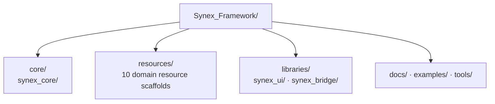

<p align="center">
  
</p>

<h1 align="center">Synex</h1>

<p align="center">
  <strong>Une fondation conçue avec rigueur pour un Framework FiveM modulaire et un écosystème cohérent de Resources officielles.</strong>
</p>

<p align="center">
  <sub>DOCUMENTATION LANGUAGE</sub><br>
  <a href="../../../README.md">EN</a>
  &nbsp;·&nbsp;
  <a href="../de/README.md">DE</a>
  &nbsp;·&nbsp;
  <strong>FR</strong>
  &nbsp;·&nbsp;
  <a href="../es/README.md">ES</a>
  &nbsp;·&nbsp;
  <a href="../pt-BR/README.md">PT-BR</a>
</p>

<p align="center">
  Synex se structure comme un seul framework, avec des responsabilités clairement définies entre son Core, ses Resources métier et ses bibliothèques partagées.<br>
  Le dépôt constitue actuellement un socle structurel : ses périmètres sont en place, mais il ne contient encore aucun code Runtime.
</p>

<p align="center">
  <a href="#pourquoi-synex">Pourquoi Synex</a> ·
  <a href="#écosystème-prévu">Écosystème</a> ·
  <a href="#architecture-du-dépôt">Architecture</a> ·
  <a href="#bien-démarrer">Bien démarrer</a> ·
  <a href="#état-du-développement">État</a>
</p>

<p align="center">
  
  
</p>

<p align="center">
  
</p>

> [!IMPORTANT]
> **Maturité actuelle :** Synex se trouve au stade de la fondation du dépôt. Les périmètres des modules documentés ci-dessous existent, mais le dépôt ne contient encore ni Resource FiveM exécutable, ni manifest, ni code Runtime, ni schéma de base de données, ni configuration, ni workflow d’installation.

## Pourquoi Synex

L’écosystème d’un Framework commence par une répartition explicite des responsabilités. Synex établit ces périmètres avant de présenter des détails d’implémentation comme des capacités du produit.

- **Organisation fondée sur les périmètres.** Le Core, les Resources métier, les bibliothèques partagées, la documentation, les exemples et les outils disposent chacun d’un emplacement distinct.
- **Namespace cohérent.** Chaque module réservé au Framework utilise le préfixe `synex_`.
- **Écosystème organisé par domaine.** Les responsabilités liées aux personnages, à l’économie, à la communication et aux véhicules sont représentées par des scaffolds de Resources indépendants.
- **Maturité fondée sur des éléments vérifiables.** Un répertoire indique une responsabilité prévue ; il n’est pas présenté comme une fonctionnalité terminée ou installable.

## Modèle de fondation

| Périmètre | Responsabilité prévue | Vérifié à ce jour |
| --- | --- | --- |
| `core/` | Emplacement du Core du Framework | Scaffold `synex_core` |
| `resources/` | Resources métier officielles | 10 scaffolds nommés |
| `libraries/` | Bibliothèques partagées du Framework | Scaffolds `synex_ui` et `synex_bridge` |
| `docs/`, `examples/`, `tools/` | Documentation du projet, exemples et outils | Structure des README localisés ; `examples/` et `tools/` réservés |

Cette organisation établit uniquement la répartition des responsabilités au sein du dépôt. Elle ne définit pas encore les dépendances Runtime, les contrats publics, les frontières Client/Server ni le comportement des services.

## Écosystème prévu

Chaque entrée ci-dessous présente actuellement le même état vérifié : **Scaffold** — le répertoire existe, mais il ne contient ni manifest de Resource ni implémentation. Les descriptions indiquent des responsabilités réservées et non des fonctionnalités disponibles.

| Domaine | Module | Responsabilité réservée |
| --- | --- | --- |
| Fondation | [`synex_core`](../../../core/synex_core/) | Périmètre du Core du Framework |
| Fondation | [`synex_ui`](../../../libraries/synex_ui/) | Périmètre de la bibliothèque UI partagée |
| Fondation | [`synex_bridge`](../../../libraries/synex_bridge/) | Périmètre du Bridge d’intégration |
| Joueur | [`synex_character`](../../../resources/synex_character/) | Périmètre du domaine des personnages |
| Joueur | [`synex_identity`](../../../resources/synex_identity/) | Périmètre du domaine de l’identité |
| Joueur | [`synex_inventory`](../../../resources/synex_inventory/) | Périmètre du domaine de l’inventaire |
| Économie | [`synex_banking`](../../../resources/synex_banking/) | Périmètre du domaine bancaire |
| Économie | [`synex_jobs`](../../../resources/synex_jobs/) | Périmètre du domaine des métiers |
| Économie | [`synex_shops`](../../../resources/synex_shops/) | Périmètre du domaine des commerces |
| Communication | [`synex_phone`](../../../resources/synex_phone/) | Périmètre du domaine du téléphone |
| Communication | [`synex_radio`](../../../resources/synex_radio/) | Périmètre du domaine de la radio |
| Mobilité | [`synex_vehicles`](../../../resources/synex_vehicles/) | Périmètre du domaine des véhicules |
| Mobilité | [`synex_garages`](../../../resources/synex_garages/) | Périmètre du domaine des garages |

## Architecture du dépôt

Ce diagramme représente le scaffold actuel du Framework. Il s’agit volontairement d’une carte du dépôt, et non d’un graphe de dépendances Runtime.



Les flèches indiquent uniquement l’emplacement des éléments de premier niveau dans le dépôt. Elles n’impliquent aucune direction de dépendance, aucun flux d’Events, aucune couche de Callbacks, aucun service Player, aucune couche de base de données ni aucune interaction NUI.

## Principes de conception visibles à ce jour

- **Responsabilités regroupées sous un namespace commun.** Les répertoires des modules appartenant au Framework partagent le préfixe `synex_`.
- **Séparation des responsabilités.** Le Core, les Resources, les bibliothèques réutilisables et les éléments de support du projet occupent des zones distinctes de premier niveau.
- **Un domaine par scaffold.** Chaque Resource prévue dispose de son propre périmètre de répertoire.
- **Les affirmations suivent l’implémentation.** Les API, les caractéristiques de performance, les garanties de sécurité et la compatibilité ne seront documentées que lorsqu’elles pourront être vérifiées à partir d’éléments présents dans le dépôt.

## Bien démarrer

> [!NOTE]
> **La documentation d’installation est en cours de préparation.**

Il n’existe pas encore de procédure d’installation vérifiée : le dépôt ne contient actuellement aucun fichier `fxmanifest.lua`, aucune définition de dépendances, aucune configuration, aucun schéma de base de données ni aucun ordre de démarrage des Resources. Les commandes ne seront publiées qu’après avoir pu être testées avec des Resources exécutables.

## Structure du dépôt

<details>
<summary>Afficher la structure actuelle de premier niveau</summary>

```text
Synex_Framework/
├── .gitattributes
├── .github/
│   └── assets/
│       ├── branding/
│       │   ├── synex-mark.svg
│       │   ├── synex-mark.png
│       │   ├── synex-mark-512.png
│       │   ├── synex-mark-256.png
│       │   ├── synex-mark-128.png
│       │   └── synex-mark-animated.gif
│       └── readme/
│           └── hero.webp
├── .gitignore
├── core/
│   └── synex_core/
├── resources/
│   ├── synex_character/
│   ├── synex_identity/
│   ├── synex_inventory/
│   ├── synex_banking/
│   ├── synex_phone/
│   ├── synex_radio/
│   ├── synex_jobs/
│   ├── synex_shops/
│   ├── synex_vehicles/
│   └── synex_garages/
├── libraries/
│   ├── synex_ui/
│   └── synex_bridge/
├── tools/
├── docs/
│   └── locales/
│       ├── README.md
│       ├── de/README.md
│       ├── fr/README.md
│       ├── es/README.md
│       └── pt-BR/README.md
├── examples/
└── README.md
```

Les répertoires des modules ne contiennent actuellement que des fichiers `.gitkeep` servant de placeholders.

</details>

## État de la pile technologique

FiveM est la plateforme cible déclarée. Le langage Runtime, la stack NUI, le moteur de base de données, le gestionnaire de paquets et le pipeline de build ne peuvent pas encore être déterminés à partir du contenu du dépôt.

## État du développement

| Domaine | État vérifié |
| --- | --- |
| Organisation du dépôt | Présente |
| Modules du Core, des Resources et des bibliothèques | Scaffolds de répertoires uniquement |
| Manifests de Resources et code Runtime | Absents |
| API publiques, Events, Exports et Callbacks | Absents |
| Base de données, configuration, permissions et systèmes de sécurité | Absents |
| Workflow d’installation et guides détaillés | Indisponibles |
| Licence | Non déclarée |

## Documentation

Les [éditions localisées](../README.md) sont indexées dans `docs/locales/`. Aucun guide fondé sur une implémentation n’est encore publié.

---

<p align="center">
  <sub>Synex Framework · Des périmètres clairs d’abord. Des capacités vérifiées ensuite.</sub>
</p>
