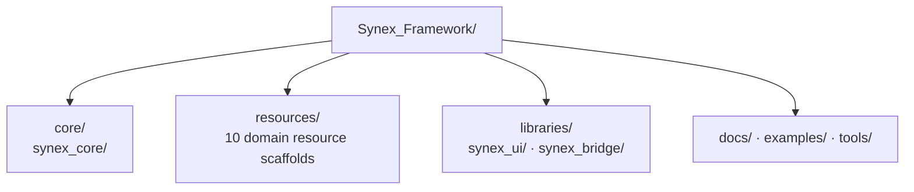

<p align="center">
  
</p>

<h1 align="center">Synex</h1>

<p align="center">
  <strong>Uma base concebida para um framework FiveM modular e um ecossistema coeso de resources próprias.</strong>
</p>

<p align="center">
  <sub>DOCUMENTATION LANGUAGE</sub><br>
  <a href="../../../README.md">EN</a>
  &nbsp;·&nbsp;
  <a href="../de/README.md">DE</a>
  &nbsp;·&nbsp;
  <a href="../fr/README.md">FR</a>
  &nbsp;·&nbsp;
  <a href="../es/README.md">ES</a>
  &nbsp;·&nbsp;
  <strong>PT-BR</strong>
</p>

<p align="center">
  O Synex está sendo estruturado como um único framework, com responsabilidades claras entre Core, resources de domínio e libraries compartilhadas.<br>
  Atualmente, o repositório é um scaffold de fundação: seus limites estruturais estão presentes, mas o código de runtime não faz parte do repositório atual.
</p>

<p align="center">
  <a href="#por-que-synex">Por que Synex</a> ·
  <a href="#ecossistema-planejado">Ecossistema</a> ·
  <a href="#arquitetura-do-repositório">Arquitetura</a> ·
  <a href="#primeiros-passos">Primeiros passos</a> ·
  <a href="#status-de-desenvolvimento">Status</a>
</p>

<p align="center">
  
  
</p>

<p align="center">
  
</p>

> [!IMPORTANT]
> **Maturidade atual:** o Synex está no estágio de fundação do repositório. Os limites dos módulos documentados abaixo existem, mas ainda não foram adicionados resources FiveM executáveis, manifests, código de runtime, schema de banco de dados, configuração ou fluxo de instalação.

## Por que Synex

Um ecossistema de framework começa com responsabilidades explícitas. O Synex estabelece esses limites antes de apresentar detalhes de implementação como capacidades do produto.

- **Estrutura orientada por limites.** Core, resources de domínio, libraries compartilhadas, documentação, exemplos e ferramentas ocupam áreas separadas.
- **Namespace coerente.** Todos os módulos reservados do framework usam o prefixo `synex_`.
- **Ecossistema orientado por domínio.** As áreas de personagens, economia, comunicação e veículos são representadas por scaffolds independentes de resources.
- **Maturidade baseada em evidências.** Um diretório indica a responsabilidade planejada; ele não é apresentado como uma funcionalidade concluída ou instalável.

## Modelo de fundação

| Limite | Responsabilidade planejada | Verificado hoje |
| --- | --- | --- |
| `core/` | Área reservada ao Core do framework | Scaffold de `synex_core` |
| `resources/` | Resources de domínio do próprio projeto | 10 scaffolds nomeados |
| `libraries/` | Libraries compartilhadas do framework | Scaffolds de `synex_ui` e `synex_bridge` |
| `docs/`, `examples/`, `tools/` | Diretrizes do projeto, exemplos e ferramentas | READMEs traduzidos e guia de integração do Discord; exemplos e ferramentas reservados |

O layout estabelece apenas a divisão de responsabilidades no repositório. Ele ainda não define dependências de runtime, contratos públicos, limites entre Client e Server ou comportamento de serviços.

## Ecossistema planejado

Todas as entradas abaixo possuem o mesmo estado verificado: **Scaffold** — o diretório existe, mas não contém um manifesto de resource nem uma implementação. As descrições indicam responsabilidades reservadas, não funcionalidades disponíveis.

| Área | Módulo | Responsabilidade reservada |
| --- | --- | --- |
| Fundação | [`synex_core`](../../../core/synex_core/) | Limite do Core do framework |
| Fundação | [`synex_ui`](../../../libraries/synex_ui/) | Limite da Library de UI compartilhada |
| Fundação | [`synex_bridge`](../../../libraries/synex_bridge/) | Limite da Bridge de integração |
| Jogador | [`synex_character`](../../../resources/synex_character/) | Limite do domínio de personagens |
| Jogador | [`synex_identity`](../../../resources/synex_identity/) | Limite do domínio de identidade |
| Jogador | [`synex_inventory`](../../../resources/synex_inventory/) | Limite do domínio de inventário |
| Economia | [`synex_banking`](../../../resources/synex_banking/) | Limite do domínio bancário |
| Economia | [`synex_jobs`](../../../resources/synex_jobs/) | Limite do domínio de jobs |
| Economia | [`synex_shops`](../../../resources/synex_shops/) | Limite do domínio de lojas |
| Comunicação | [`synex_phone`](../../../resources/synex_phone/) | Limite do domínio de telefone |
| Comunicação | [`synex_radio`](../../../resources/synex_radio/) | Limite do domínio de rádio |
| Mobilidade | [`synex_vehicles`](../../../resources/synex_vehicles/) | Limite do domínio de veículos |
| Mobilidade | [`synex_garages`](../../../resources/synex_garages/) | Limite do domínio de garagens |

## Arquitetura do repositório

Este diagrama representa o scaffold atual do framework. Ele é intencionalmente um mapa do repositório, não um grafo de dependências de runtime.



As setas indicam apenas a localização no nível superior do repositório. Elas não implicam direção das dependências, fluxo de eventos, camada de callbacks, serviço de jogador, camada de banco de dados ou interação NUI.

## Princípios de design visíveis hoje

- **Responsabilidade por namespace.** Os diretórios dos módulos pertencentes ao framework compartilham o prefixo `synex_`.
- **Separação de responsabilidades.** Core, resources, libraries reutilizáveis e suporte ao projeto ocupam áreas distintas no nível superior.
- **Um domínio por scaffold.** Cada resource planejada é delimitada por um diretório independente.
- **As afirmações acompanham a implementação.** APIs, características de performance, garantias de segurança e compatibilidade só serão documentadas quando puderem ser verificadas nos artefatos do repositório.

## Primeiros passos

> [!NOTE]
> **A documentação de instalação está sendo preparada.**

Ainda não existe um procedimento de instalação verificado: atualmente, o repositório não contém `fxmanifest.lua`, definição de dependências, configuração, schema de banco de dados ou ordem de inicialização de resources. Os comandos serão publicados somente depois que puderem ser testados com resources executáveis.

## Estrutura do repositório

<details>
<summary>Ver a estrutura atual de nível superior</summary>

```text
Synex_Framework/
├── .gitattributes
├── .github/
│   ├── assets/
│   │   ├── branding/
│   │   └── readme/
│   ├── scripts/
│   │   └── discord/
│   └── workflows/
├── .gitignore
├── core/
│   └── synex_core/
├── resources/
│   ├── synex_character/
│   ├── synex_identity/
│   ├── synex_inventory/
│   ├── synex_banking/
│   ├── synex_phone/
│   ├── synex_radio/
│   ├── synex_jobs/
│   ├── synex_shops/
│   ├── synex_vehicles/
│   └── synex_garages/
├── libraries/
│   ├── synex_ui/
│   └── synex_bridge/
├── tools/
├── docs/
│   ├── discord-notifications.md
│   └── locales/
│       ├── README.md
│       ├── de/README.md
│       ├── fr/README.md
│       ├── es/README.md
│       └── pt-BR/README.md
├── examples/
└── README.md
```

Atualmente, os diretórios dos módulos contêm apenas placeholders `.gitkeep`.

</details>

## Status tecnológico

FiveM é a plataforma-alvo declarada. A automação do repositório usa módulos JavaScript sem dependências no Node.js 24 por meio do GitHub Actions. Com base no conteúdo atual, ainda não é possível determinar a linguagem de runtime do framework, a stack NUI, a engine de banco de dados, o gerenciador de pacotes ou o pipeline de build dos resources.

## Status de desenvolvimento

| Área | Estado verificado |
| --- | --- |
| Organização do repositório | Presente |
| Feed de desenvolvimento do GitHub para o Discord | Implementado e coberto pelos testes de automação do repositório |
| Módulos de Core, resources e libraries | Apenas scaffolds de diretórios |
| Manifestos de resources e código de runtime | Ausentes |
| APIs públicas, eventos, Exports e callbacks | Ausentes |
| Banco de dados, configuração, permissões e sistemas de segurança | Ausentes |
| Fluxo de instalação do framework e guias de runtime | Não disponíveis |
| Licença | Não declarada |

## Documentação

- [Configuração, operação e segurança das notificações do Discord](../../discord-notifications.md)
- [Versões localizadas desta landing page](../README.md)

Os guias de instalação e runtime do framework ainda não estão disponíveis.

---

<p align="center">
  <sub>Synex Framework · Primeiro, limites claros. Depois, capacidades verificadas.</sub>
</p>
