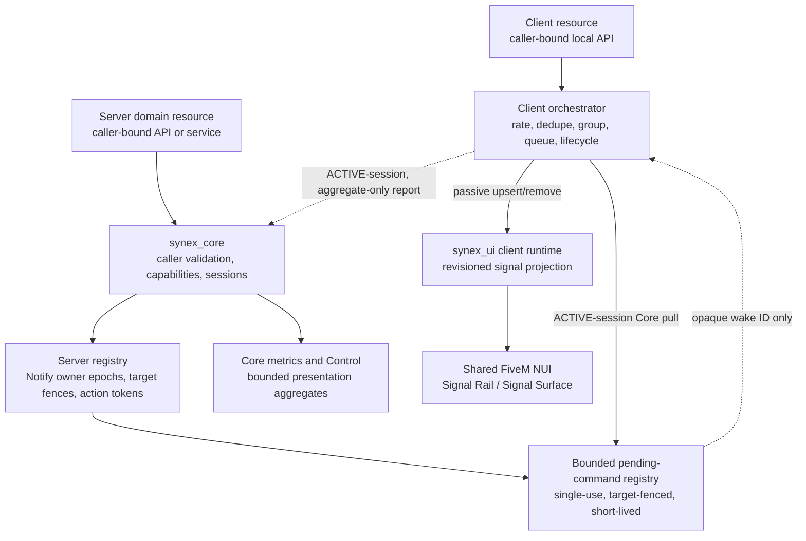

# Notify architecture

`synex_notify` separates feedback semantics from rendering. Gameplay and
framework resources describe a bounded notification; Notify owns its lifecycle
and delivery policy; `synex_ui` renders the passive Signal Surface.



## Domain boundary

Notify owns:

- canonical `kind`, `tone`, and `priority` semantics;
- bounded validation and safe text/icon/action DTOs;
- owner epochs, handles, monotonic revisions, expiry, and cleanup;
- resource/global/kind/priority budgets;
- deduplication, grouping, queue arbitration, and presentation policy;
- progress state and coalesced render projection;
- session-bound, expiring, single-use server action tokens;
- bounded history, health, metrics, Doctor, and Control projections.

Notify does not own chat, mail, a phone inbox, audit history, localization,
gameplay authorization, or durable domain facts. A banking transfer remains true
because the banking/accounts domain committed it, not because a success signal
was shown.

## Runtime sides

### Server

The direct server facade, `synex.notify@1` service, and Bridge adapter preserve
the immediate resource principal. A Core-service `callerEpoch` is required and
validated at that boundary, but it is not copied into record identity. All three
entry paths resolve the resource through one Notify-owned incarnation registry
and attach that canonical Notify epoch to records and handles. A target is the
complete `{ source, sessionId, sourceGeneration }` reference; the registry
resolves the active Core session before admission and again before queuing each
client command. A delayed request cannot be delivered merely because the same
numeric source is online again.

Canonical server commands enter a bounded, short-lived pending registry behind
an opaque ID. The Cfx client event carries only that ID as an untrusted wake-up.
The target client redeems it through the Core network RPC
`synex.notify.command.pull`; the server atomically consumes it only when the
active caller source, session ID, and source generation match its recorded
target. The raw event is never notification-payload authority.

The server retains only bounded process-local records needed for later updates,
dismissal, owner cleanup, action validation, aggregates, and short history. A
record is separately marked `presenting` or inactive/`retained`: an elapsed
presentation loses its action tokens but keeps its revisioned handle until hard
expiry or oldest-inactive pressure eviction. A full newer update can revive it
with a new bounded presentation window. The server does not infer whether a
browser frame has painted the signal; its presentation deadline is a
conservative send-time bound. The target client runs the actual visible queue
and presentation lifecycle.

### Client

The client facade captures `GetInvokingResource()` and binds a facade to that
resource's client-local owner epoch. Local requests cannot name another owner or
another player. Incoming wake references are bounded and drained serially so
command order is preserved. A server command is accepted only after the Core
pull returns its canonical server owner, epoch, target session fence,
notification ID, origin, and revision. A raw or forged Cfx event cannot mutate
the current session generation or enter the render queue.

The client is the presentation authority for its own viewport. It validates the
canonical DTO again, applies local rate/presentation policy, owner-scoped quiet
and position-reservation contexts, deduplication and grouping, schedules the
bounded visible stack, expires records, and projects only the current revision
into `synex_ui`. Presentation contexts are epoch-owned, bounded, and contain no
domain policy or arbitrary pixel offsets.

It also reports a fixed, aggregate-only presentation snapshot to Core through
the internal `synex.notify.metrics.report` RPC. The first counter snapshot remains
frozen across a bounded short retry window until Core acknowledges the server
baseline; activity accumulated meanwhile is preserved for the next delta. Later
reports normally run every 10 seconds. The server revalidates the active
session/source generation, derives bounded monotonic deltas, and emits label-free
counters, gauges, and latency observations. A new
session or client generation starts a fresh baseline instead of replaying prior
cumulative counters. This telemetry contains no notification content or IDs and
is explicitly non-authoritative: it may describe presentation pressure, but it
cannot establish delivery, identity, authorization, or a domain fact.

`synex_ui` derives an adaptive one-to-four visible capacity from its native safe
viewport metrics and current scale/density preferences. A private
`bindSignalCapacity` callback exists only on the immediate `synex_notify`
facade. Its exact report contains the owner/epoch, capacity, and the closed
central UI preference snapshot. It is coalesced onto the next client turn,
caller/epoch-bound, and rejected unless the current Notify binding explicitly
accepts both capacity and preferences. This keeps Notify diagnostics and policy
state synchronized after scale, density, reduced-motion, transparency, or
contrast changes without adding a network event, browser-selected owner, focus,
or browser polling loop. Notify applies capacity in its queue engine so demoted records
are not silently rendered off-screen while their visible lifetime runs.

When a server-originated visible duration ends, the client removes its surface
and actions but retains the record as dormant until hard expiry. Under client
pressure, one of at most 512 bounded tombstones may replace dormant state while
preserving only the owner/source revision and hard-lifetime fence. A newer full
server update revives through the same dedupe/group/capacity policy; stale
revisions, owner epochs, and source/session generations remain fenced.

### Shared UI runtime

`synex_ui` is optional at resource-dependency level and authoritative only for
presentation. Its bounded revisioned signal upsert/remove/snapshot operations
are private to the immediate `synex_notify` owner; another resource receives
`UI_SIGNAL_DENIED`. An accepted upsert is retained in the UI store and returns a
`delivered` flag. `delivered = false` means the state is available for later
reconciliation but no ready/successful browser send was observed. Its existing
NUI renders synchronized Signal state using Synex tokens, materials, icons,
accessibility preferences, and screen metrics.

Visual cards are accessible named groups, not independent live regions. A
single bounded browser-side announcement controller serializes their plain-text
projection into stable polite and assertive endpoints. It coalesces revisions
of the same grouped signal for 120 ms, prioritizes critical speech without
discarding queued normal speech outside the documented pressure bound, and
clears timers, pending entries, and dedupe history when the surface unmounts or
the browser runtime boots again.

A signal does not request a focus lease and does not call `SetNuiFocus`. The
browser surface is display-only; notification actions are rendered as input
hints and invoked through the client action path, not by turning a toast into a
pointer-driven mini-dialog. Interactive or multi-step decisions belong in a
proper `synex_ui` dialog.

If `synex_ui` is stopped, malformed, or not ready, Notify becomes `DEGRADED`.
Ordinary gameplay feedback is not redirected into a native feed. The fallback
is intentionally text-only, action-free, and restricted to an admitted critical
framework signal. A UI restart is followed by a bounded resynchronization of
current signal revisions.

Notify treats a rejected upsert and an accepted-but-`delivered = false` upsert
as transport failure evidence. Neither counts as client display, and sound is
not played. A synchronously accepted send is not proof of browser paint: a
critical signal also requires its exact active-surface ACK within 1,250 ms.
Otherwise Notify attempts the text-only native fallback once for that content
generation. Retained UI-store state remains useful for the later
ready/reconciliation path but is not a browser paint receipt.

The browser reports the exact Signal Surfaces that are actually in the `active`
phase, excluding planned-but-displaced and 140 ms dismissing entries. The report
is fenced by browser boot, signal generation, signal revision, the current
adaptive capacity, and monotonically increasing per-boot
`presentationRevision`, and transient failures are retried.
Notify does not initially project action hints until the surface is confirmed
active, and never enables F9/F10 until the exact current action-bearing revision
is confirmed; restart, stale ACK, or CEF transport loss fails closed.

## Data flow

The logical admission path is:

```text
request
  -> closed-shape and byte validation
  -> owner/epoch validation
  -> server target/session validation, when applicable
  -> capability and priority validation
  -> dedupe/group lookup and bounded-capacity/action preflight
  -> burst preflight
  -> atomic token check/debit
  -> commit dedupe/group/burst/eviction or new record
  -> bounded pending-command admission and opaque wake, for server delivery
  -> active-session, exact-target, single-consumer Core pull
  -> presentation policy
  -> priority/age queue
  -> visible stack
  -> revisioned UI projection
  -> browser active-surface ACK before action projection/invocation
```

Some outcomes intentionally do not create a new surface. A dedupe request may
return the existing handle, a grouped request may update a group representative,
and policy may suppress a low-value request. These are successful orchestration
outcomes, not proof that a new card appeared.

## Persistence and restart behavior

All Notify state is bounded and in memory. There is no MariaDB migration,
notification table, offline inbox, durable delivery receipt, or cross-restart
action replay.

- Caller stop removes that owner epoch's local/server records and actions.
- Player disconnect removes records fenced to that session/source.
- Player disconnect also removes its presentation-metric gauge contribution; a
  missed drop becomes unavailable after the 30-second freshness window and the
  bounded registry may later prune that stale entry deterministically.
- Notify restart clears queue, history, handles, and tokens.
- `synex_ui` restart temporarily degrades rendering; Notify resends a bounded
  current snapshot when the runtime becomes available.
- A domain that needs restart recovery must reconstruct its own current fact and
  decide whether a new notification is still useful.

Local and server owner epochs are tracked independently on the client. A newer
epoch cleans only older state in its authority namespace; a late older epoch or
bounded owner-stop command cannot reset the new incarnation's state/budgets.
Server records/actions additionally retain the exact
`{source, sessionId, sourceGeneration}` fence, so Cfx source reuse is not treated
as identity continuity.

## Dependencies

- `synex_core` is required for the server-side caller, epoch, capability,
  service, session, ID, metrics, event, and Control boundaries.
- `synex_ui` is a controlled optional renderer.
- `synex_control` may consume the registered provider through Core; Notify does
  not depend on the Control resource or its NUI.
- Accounts, Groups, World, Entities, inventory, phone, and other gameplay
  domains are not dependencies.

The adopted boundary is recorded in
[ADR-0010](../architecture/decisions/0010-ephemeral-notification-orchestration.md).
