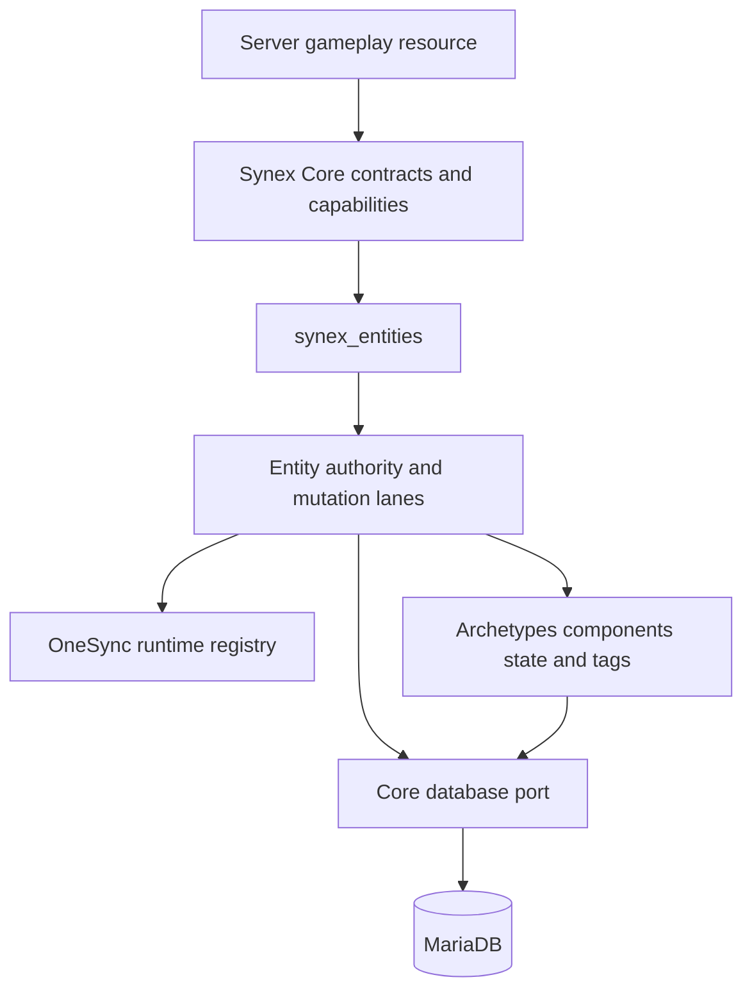

# Synex Entity Authority Engine

> [!WARNING]
> `synex_entities` is in **Development / Experimental Alpha**. Its contracts, migrations and server-authoritative implementation are present and covered by repository tests, but the current candidate has not completed a fresh MariaDB migration, live FXServer/OneSync, restart/recovery or real-client acceptance. It is outside the frozen `synex_core` Production-Beta boundary and is not production-approved.

`synex_entities` is the server-only authority layer for Synex-managed vehicles, peds, objects and routing buckets. It separates durable domain identity from the transient Cfx runtime, applies capability checks at every public boundary, and keeps extension data inside resource-owned schemas.

The resource exposes no client-callable contract and no NUI. Gameplay resources validate their own domain request on the server and then call a versioned Entity contract through `synex_core`.

## Authority model

An entity reference is `{ entityId, generation }`:

- `entityId` is a Core-issued opaque identifier and remains the durable domain identity.
- `generation` fences stale references after rematerialization or recovery.
- `netId` is the current OneSync transport identifier. It is never persisted and may be reused.
- `networkOwner` is the Cfx transport owner observed at inspection time. **It never grants Synex authorization, logical ownership or mutation rights.**
- `owner` is the logical domain owner (`character`, `group`, `resource`, `system` or `user`).
- `resourceOwner` is the server resource that owns the Entity definition and its mutation boundary.
- `binding` is an optional unique domain reference such as a vehicle-record identity.

All public operations use Core-supplied caller context. Client payloads cannot choose the invoking resource, capability grant, authority lease or resource epoch.

## Runtime architecture



The current implementation includes:

- a bounded runtime registry indexed by Entity ID, handle, NetID, logical owner, resource owner, binding and bucket;
- a bucket-isolated spatial hash for bounded nearby queries;
- owner-epoch mutation lanes for Entity and binding serialization;
- MariaDB-backed persistent Entity authority leases and recovery history;
- schema-owned archetype, component and state registries;
- lifecycle, drift and recovery workers plus a bounded process-local native-cleanup queue;
- domain events, pre-operation hooks, audit records and bounded metrics through Core;
- a read-only `synex.entities@1` operator service for health/control summaries, bounded diagnostics, stable-ID inspection and bounded owner/resource/bucket queries.

The Core database facade is the persistence port. Entity code does not expose SQL or accept caller-provided statements.

## Lifecycle

Durable state and OneSync state are separate:

```text
definition -> materializing -> materialized -> checkpoint/dematerialize
     |                                 |
     +---------- recovery <------------+
```

Persistent definitions use database-time authority leases containing an instance, resource epoch, lease generation and expiry. Only the current lease holder may materialize or recover the definition. A competing or stale holder fails closed.

The implemented persistence policies are `temporary`, `session`, `owner_lifetime` and `persistent`. Recovery policies are `none`, `manual`, `on_demand` and `automatic`; automatic recovery is rejected unless the definition uses durable `persistent` or `owner_lifetime` persistence. Recovery is bounded by a batch size, interval, backoff policy and circuit/storm threshold. Failed attempts are recorded without treating a partial runtime result as success.

Resource and Entity lifecycle handlers cover player drops, resource starts/stops, removed entities and bucket changes. Temporary runtime state is cleaned up on owner stop. Persistent state is released into a recoverable or dormant state according to policy. Character and Group deletion preflight blocks while persistent owned definitions remain; after explicit transfer/deletion resolves those rows, the coordinated lifecycle action deletes the remaining non-persistent definitions in bounded batches.

### Runtime cleanup compensation

An immediate native deletion that cannot be verified can enqueue a deduplicated process-local finding. Capacity is `max(64, min(maxEntities, 20000))`; one recovery tick retries at most `recoveryBatchSize` findings in insertion order. Pending work sets `ENTITY_CLEANUP_PENDING` / `DEGRADED`, while a full queue sets `ENTITY_CLEANUP_QUEUE_EXHAUSTED` / `UNHEALTHY`. Once the queue is empty, it restores `READY` only when that exact pending reason is still active; unrelated health reasons are never overwritten. Queue/resolution/exhaustion actions are audited and pending/retry/overflow metrics remain bounded.

Retry does not trust a remembered handle alone. Unregistered-spawn cleanup verifies the current type, model and NetID when available. Registered cleanup repeats full runtime identity inspection. If Cfx has recycled the handle, Synex resolves/detaches the stale finding without deleting the unrelated replacement. The queue is in memory and is not a restart-durable cleanup journal.

## Routing buckets

Managed buckets are owner-bound and generation-fenced. Bucket `0` is the unmanaged default and uses generation `0`. Nonzero managed buckets use an opaque generation so a reused numeric bucket cannot satisfy a stale request.

The resource validates ownership, capacity and current generation before moving an Entity or player. Managed profiles can control purpose, capacity, lockdown, population and expiry. Routing buckets are dimensions for sessions and isolated game modes; they are not an interior or MLO system.

## Extension model

Extension namespaces are resource-owned and resource-epoch-bound:

- **Archetypes** describe allowed Entity types/models and default persistence/recovery behavior.
- **Components** use registered, bounded schemas and `runtime`, `persistent` or `replicated` storage modes.
- **State** uses registered scalar/JSON types, `server` or `client_observed` authority metadata, and bounded `none`/`scoped` replication. `scoped` is the explicit current State Bag projection; `client_observed` metadata is accepted only with that mode. There is no owner-only replication contract.
- **Tags** provide bounded, namespace-controlled indexing metadata.

Schema registrations reject unknown fields, unsupported schema nodes, excessive depth/size, cycles, metatables and namespace impersonation. Component and state writes use generation/version fences and remain server-only even when their resulting value is replicated through a state bag.

## Contract catalog

The source declares 33 experimental, closed-schema, capability-gated `network: none` definitions across 32 unique contract names. `synex.entities.bucket.create` retains v1 compatibility and adds a v2 profile/capacity form; the other names are currently version `1.0.0`.

| Surface | Contracts | Capability boundary |
| --- | --- | --- |
| Legacy lifecycle | `spawn`, `get`, `resolve_persistent`, `delete` | `synex.entities.spawn`, `.read`, `.delete` |
| Authority lifecycle | `materialize`, `dematerialize`, `checkpoint`, `owner.set`, `binding.get` | `.materialize`, `.dematerialize`, `.checkpoint`, `.owner.change`, `.query` |
| Archetypes | `archetype.register` | `.archetype.register` |
| Components | `component.schema.register`, `component.get`, `component.set`, `component.remove` | `.component.schema.register`, `.component.read`, `.component.write` |
| State | `state.schema.register`, `state.get`, `state.set` | `.state.schema.register`, `.state.read`, `.state.write` |
| Tags | `tags.add`, `tags.remove` | `.tags.write` |
| Queries | `query.by_net_id`, `query.by_owner`, `query.by_resource`, `query.by_binding`, `query.by_bucket`, `query.nearby` | `.query` |
| Buckets | `bucket.create`, `bucket.destroy`, `bucket.get`, `bucket.move_entity`, `bucket.move_player` | `.bucket.create`, `.bucket.destroy`, `.bucket.read`, `.bucket.entity.move`, `.bucket.player.move` |
| Context and health | `context.validate`, `health` | `.context.validate`, `.read` |

Canonical request/response schemas, rate limits and structured error sets are generated from [`entities.contracts.json`](../../resources/synex_entities/contracts/entities.contracts.json). The [generated contract catalog](../../packages/contracts/generated/docs/contracts.md) is the API-level reference.

`synex.entities.bucket.create@2.0.0` requires a Core invocation `idempotencyKey` of 8–36 safe characters. The key is durably bound to the real caller, contract version and complete request before a bucket is allocated, so replaying an exact request after a lost response returns the original bucket reference rather than allocating another bucket. The compatibility-only v1 create form remains callable without a key. Bucket destroy and player-move calls preserve their historical no-key compatibility, but any supplied invocation key receives the same caller-bound durable replay and changed-request conflict protection. A consumer coordinating multiple bucket side effects must assign a distinct stable key to every create, move and destroy stage.

Before a failure crosses Core's provider boundary, Entities restricts it to the exact generated error set for the invoked contract/version. Internal database, persistence, capability and idempotency failures are mapped to compatible stable codes; provider trace IDs and native/driver details are removed; only bounded quota scope/limit details may survive. Core attaches the consumer-facing trace ID.

Every consumer must declare the exact contract under `contracts.consume`, request its capability and receive an explicit Core policy grant. A grant without a declaration, or a declaration without a grant, fails closed.

## Events and hooks

The resource declares these bounded domain events:

- `synex.entities.created`
- `synex.entities.materialized`
- `synex.entities.dematerialized`
- `synex.entities.orphaned`
- `synex.entities.recovered`
- `synex.entities.owner.changed`
- `synex.entities.bucket.changed`
- `synex.entities.deleted`

Policy hooks run before spawn, delete, checkpoint, owner change, bucket move and recovery under the `synex.entities.before_entity_*` namespace. Hook rejection fails the operation; hooks are not an authorization replacement.

Those hooks apply to explicit caller operations. Mandatory resource/owner cleanup and authority-loss reconciliation cannot be vetoed by an extension hook; they remain bounded and fenced and attempt bounded Core publication/audit of the resulting dematerialized, orphaned or deleted lifecycle outcome. Publication is best effort; failure degrades Entity health as `OBSERVABILITY_UNAVAILABLE` but cannot revive an already committed transition.

## Persistence ownership

Four forward-only migrations own eight tables:

| Migration | Durable scope |
| --- | --- |
| `001_entities` | `synex_entities` base definition and tombstone model |
| `002_entity_lifecycle_authority` | lifecycle, policy, provenance, archetype and recovery fields on Entity definitions |
| `003_entity_extensions` | bindings, components, states, tags and checkpoints |
| `004_entity_cluster_recovery` | authority leases and recovery history |

Owned tables are:

```text
synex_entities
synex_entity_bindings
synex_entity_components
synex_entity_states
synex_entity_tags
synex_entity_checkpoints
synex_entity_authority_leases
synex_entity_recovery_history
```

Runtime handles and NetIDs are not durable identity. The base migration intentionally does not persist them.

## Configuration

All values are read when the resource starts and are clamped to hard bounds in code.

| ConVar | Default | Implemented bound or role |
| --- | ---: | --- |
| `synex_entities_authority_lease_seconds` | `30` | `10..300` seconds |
| `synex_entities_server_scope` | `default` | Authority dataset scope |
| `synex_entities_spawn_timeout_ms` | `2500` | `250..10000` ms |
| `synex_entities_checkpoint_debounce_ms` | `5000` | `1000..60000` ms per Entity generation |
| `synex_entities_recovery_interval_ms` | `5000` | `1000..60000` ms |
| `synex_entities_recovery_batch_size` | `16` | `1..128` definitions |
| `synex_entities_recovery_base_delay_seconds` | `2` | `1..3600` seconds |
| `synex_entities_recovery_max_delay_seconds` | `60` | At least the base; maximum `86400` seconds |
| `synex_entities_recovery_jitter_seconds` | `2` | `0..max delay` |
| `synex_entities_recovery_max_attempts` | `5` | `1..1000` attempts per window |
| `synex_entities_recovery_window_seconds` | `300` | `1..86400` seconds |
| `synex_entities_recovery_storm_threshold` | `8` | `2..128` failures |
| `synex_entities_rehydrate_limit` | `512` | `1..5000` rows |
| `synex_entities_drift_interval_ms` | `60000` | `10000..3600000` ms |
| `synex_entities_drift_scan_limit` | `512` | `16..5000` rows |
| `synex_entities_bucket_min` / `_max` | `1000` / `999999` | Managed numeric range |
| `synex_entities_max_entities` | `4096` | Maximum `20000` |
| `synex_entities_max_owner_entities` | `1024` | Clamped to total maximum |
| `synex_entities_max_logical_owner_entities` | owner maximum | Clamped to total maximum |
| `synex_entities_max_persistent_entities` | total maximum | Clamped to total maximum |
| `synex_entities_max_vehicle_entities`, `synex_entities_max_ped_entities`, `synex_entities_max_object_entities` | total maximum | Per-type maximum, clamped to total |
| `synex_entities_max_buckets` | `1024` | Maximum `10000` |
| `synex_entities_max_owner_buckets` | `128` | Clamped to total maximum |
| `synex_entities_max_bucket_entities` | `512` | Clamped to total Entity maximum |
| `synex_entities_max_bucket_players` | `256` | Maximum `2048` |
| `synex_entities_spawn_rate_window_ms` | `60000` | `1000..3600000` ms |
| `synex_entities_spawn_rate_vehicle`, `synex_entities_spawn_rate_ped`, `synex_entities_spawn_rate_object` | `20` | Per-scope/type window limit, maximum `10000` |

## Read-only control plane

When both experimental resources are running and the operator has `synex.control.view`, `synex_control` can show:

- separate bounded Runtime, Persistence, Bindings, Owners, Resources, Buckets, Recovery, Drift, Components, State, Quotas and Health views;
- an exact definition/runtime inspector by stable Entity ID;
- an exact Recovery inspector by stable Entity ID with generation, policy/status, attempt count, circuit, last failure, next retry, recovery-window start and a 1-through-25-row bounded history;
- a `character_relations` inspector with the exact persistent-Entity link count and at most eight links, without Component payloads or State values;
- managed-bucket metadata plus a bounded page of non-deleted Entity definitions assigned to that bucket, with current runtime data merged when available;
- authority, recovery and Core metric projections without a write path.

The control resource receives only `synex.entities.read`, `synex.entities.query` and `synex.entities.bucket.read`. It has no Entity mutation capability, database access or mutating NUI callback. The UI labels network ownership as transport-only. Doctor additionally reports bounded generation/NetID drift, persistent runtime orphans, component/state schema mismatches, bucket ownership/membership conflicts and the current terminal-materialization spawn-failure rate. Health summaries contain at most 10 cleanup findings; the Doctor diagnostic snapshot contains at most 50 plus capacity/count/truncation metadata. Neither observer surface triggers a retry.

## Verification status

On 2026-08-26 the current working tree passed the focused Entities suite (128/128), full repository run (815 passed, 0 failed, 29 expected live-database skips out of 844), database scope with its gate closed (72 passed, 0 failed, 29 skipped), security scan (228 files, 0 findings), dependency audit (0 vulnerabilities), documentation checks (5/5), and deterministic local benchmark. These gates cover contract closure/bounds, capability policy, manifest/descriptor consistency, schema structure, registry indexes, spatial isolation, extension ownership, JSON bounds and selected Lua behavior. A separately gated disposable-MariaDB case is present for persistent-key and binding races, single-winner authority claims, expired takeover, generation advancement and stale-authority denial. Its presence is not a pass: it must run against the exact candidate, and neither it nor the headless checks certify OneSync runtime behavior.

Before promotion beyond Alpha, the exact candidate still needs:

1. a fresh MariaDB migration/schema run including the gated Entity concurrency and authority case;
2. real FXServer startup through Entity `READY` with OneSync enabled;
3. spawn/materialize/checkpoint/dematerialize/delete acceptance for vehicle, ped and object paths;
4. restart, expired-lease, duplicate-prevention and automatic-recovery tests;
5. bucket creation/move/destroy and capacity tests with a real client;
6. resource-stop cleanup, NetID reuse and Entity removal tests;
7. Control NUI closed/open/search/close/reconnect verification in FiveM CEF.

Until that evidence exists, installation and production guidance is intentionally withheld. See [Testing](../testing.md), [Operations](../operations.md), [Compatibility](../compatibility/README.md) and the [read-only control plane](control-plane.md).

## Detailed guides

- [Overview](../entities/overview.md)
- [Identity](../entities/identity.md)
- [Lifecycle](../entities/lifecycle.md)
- [Materialization](../entities/materialization.md)
- [Persistence](../entities/persistence.md)
- [Bindings](../entities/bindings.md)
- [Ownership](../entities/ownership.md)
- [Components](../entities/components.md)
- [State](../entities/state.md)
- [Routing buckets](../entities/routing-buckets.md)
- [Recovery](../entities/recovery.md)
- [Cluster authority](../entities/cluster-authority.md)
- [Security](../entities/security.md)
- [Development](../entities/development.md)

## Platform references

- [Cfx.re OneSync](https://docs.fivem.net/docs/scripting-reference/onesync/)
- [Cfx.re routing buckets](https://cookbook.fivem.net/2020/11/27/routing-buckets-split-game-state/)
- [Cfx.re server security](https://docs.fivem.net/docs/developers/server-security/)
