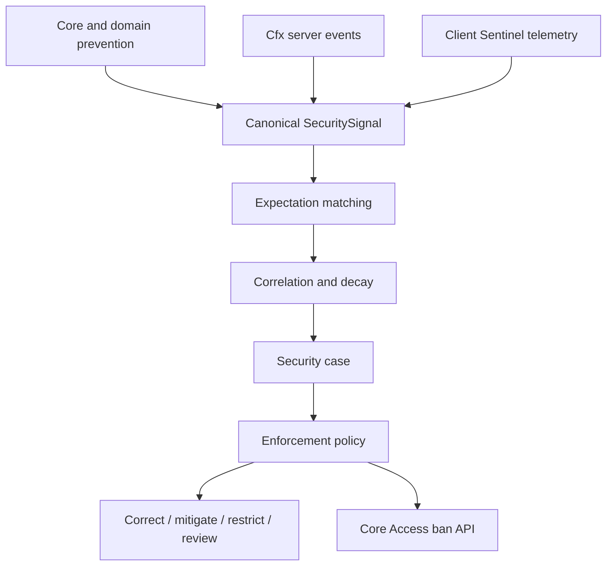

# Security architecture

## Processing pipeline

Prevention is deliberately outside the Security resource. An invalid economy,
inventory, entity, world, or interaction request must be denied before a signal
is emitted. A signal describes what happened; it is not authorization to apply
the original operation.

## Component map

| Component | Responsibility |
| --- | --- |
| `shared/limits.lua` | Closed vocabularies, trust weights, capacities, TTLs, windows, and modes |
| `shared/validation.lua` | Closed-object, subject, identifier, JSON-container, depth, entry, and byte validation |
| `server/signals.lua` | Canonicalization, namespace ownership, current-session checks, deduplication, bounded retention |
| `server/expectations.lua` | Resource/epoch ownership, TTL, revisions, selectors, matching, cleanup |
| `server/correlation.lua` | Expected-signal filtering, root-event collapse, decay, evidence weighting, hypotheses |
| `server/cases.lua` | Revisioned case lifecycle and bounded summaries |
| `server/enforcement.lua` | Policy evaluation, subject revalidation, idempotent action dispatch, Core Access delegation |
| `server/sentinel.lua` | Network report validation, sequence/challenge/freshness/liveness state |
| `server/movement.lua` | Bounded movement history and observe-first temporal patterns |
| `server/detectors.lua` | Player, weapon, damage, and combat observations |
| `server/cfx_guards.lua` | Cfx entity and game-event hooks plus bounded burst windows |
| `server/hardening.lua` | Read-only ConVar and routing-bucket findings |
| `server/core_diagnostics_cursor.lua` | Generation-aware, KVP-checkpointed Core-denial ingestion |
| `server/repository.lua` | Case, signal-summary, enforcement, and retention persistence |
| `server/control_provider.lua` | Read-only Control views |
| `server/runtime.lua` | Core acquisition, contracts, service, subscriptions, scheduler, restart binding |

The client consists only of `client/sentinel.lua`. Its data is explicitly
untrusted and cannot grant authority.

## Public boundary

The experimental service is `synex.security@1`. Resource callers require exact
Core capability grants:

- `synex.security.signal.emit` for signals;
- `synex.security.expectation.manage` for expectations;
- `synex.security.case.read` for assessments, expectations, and cases;
- `synex.security.diagnostics.read` for health and diagnostics;
- `synex.security.enforce` for revision-bound case transition/reopen methods;
- `synex.access.manage` for the existing Core Access ban boundary; Security has
  no separate ban store or direct client enforcement route.

No checked-in resource is granted `synex.security.enforce`. The lifecycle
methods are reserved for a separately reviewed server-side operator provider and
require intent auditing before mutation.

Service ownership is derived from Core caller context. The caller cannot choose
another resource's owner epoch or claim a foreign namespace. Session-bound
subjects are checked against the current Core session/source generation.

## Data flow and persistence

Canonical signals are held in bounded memory for correlation. The engine groups
them into hypotheses and creates revisioned cases above the configured case
threshold. Durable records contain bounded summaries rather than unrestricted
telemetry. The migration creates foreign-key relationships from case signals and
enforcements to their case.

Case projections and their contributing signals commit in one transaction.
Applied-enforcement completion and the resulting case projection also commit
together. Duplicate signal ownership conflicts fail closed. A duplicate or
restart-leftover `DECIDED` enforcement is atomically quarantined as
`INDETERMINATE`; it is never replayed automatically and remains visible as a
degraded-health/manual-review condition.

Core denial ingestion uses the Core-provided diagnostic stream generation and a
single synchronous resource KVP checkpoint. A Security restart resumes after the
last accepted finding; a Core generation change consumes the retained new stream
from its beginning. Retention gaps are surfaced explicitly rather than silently
treated as complete history.

Expectations are process-local and intentionally expire. They are revoked when
their owning resource stops or its owner epoch advances. They are not durable
permissions.

## Failure behavior

- Invalid or oversized signal and expectation input fails closed.
- Stale resource epochs and stale player generations fail closed.
- A missing strong-action handler or unavailable subject validator blocks the
  action.
- Persistence errors degrade Security; they must not turn a denied domain
  operation into an allow.
- Client telemetry loss creates advisory liveness evidence, not an automatic
  permanent ban.
- The hardening advisor never changes server configuration.

## Acceptance boundary

This architecture is implemented but remains **Experimental / Alpha**. Repository
tests are not proof of deployed Cfx event cancellation or OneSync behavior.
`startProjectileEvent` and `ptFxEvent` cancellation are specifically live-gated;
all runtime behavior still requires real FXServer acceptance.
