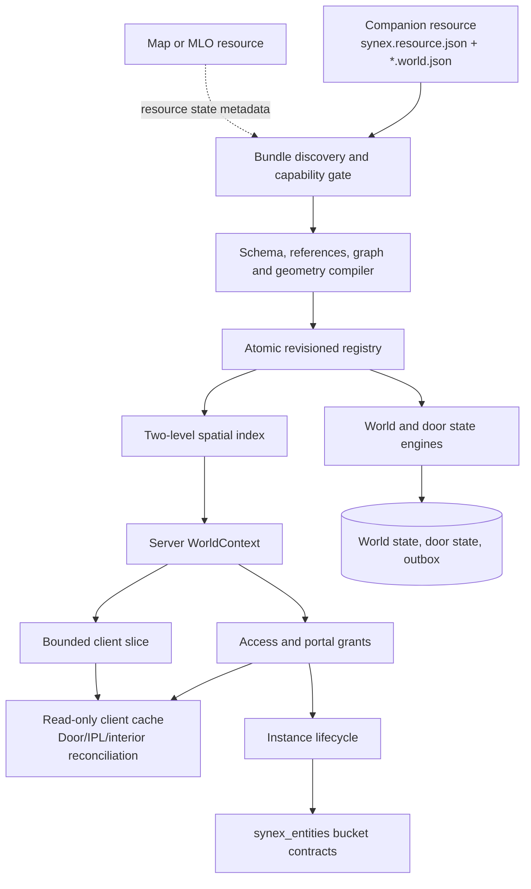

# World architecture

The resource separates declarative compilation, read-side spatial work, server-authoritative mutation and client presentation.

## Static activation path

1. Core exposes started resource descriptors and their declared `worldBundles` paths.
2. The loader confirms the owner epoch, resource state, declaration and `synex.world.bundle.register` capability.
3. The bundle is read with a 4 MiB limit and decoded as a plain JSON object.
4. The compiler validates owner namespaces, fields, geometry and references.
5. The combined graph, cross-resource dependencies and spatial index are rebuilt before activation.
6. Only a fully valid candidate replaces the active registry. Activation increments the registry revision and assigns that revision to all objects in the bundle.

Before discovery, the registry binds once to the current Core-issued `synex_world` owner epoch. Each World epoch receives a disjoint 65,536-value range inside the signed 31-bit client/contract boundary. At most 65,535 successful registry mutations are therefore possible in one World process; exhaustion fails closed. A fresh `synex_world` process running under the same Core cannot make an old `WorldRef` current merely by activating the same key first.

The modules expose owner-stop/replacement cleanup for old objects, stale-reference tombstones, slice invalidation, instances and caller-local state. The resource runtime must register those hooks with Core/Cfx lifecycle before this behavior is deployment-active.

## Read path

Runtime position queries go through the spatial index, then exact geometry checks. `WorldContext` is calculated from server-observed coordinates. A per-player slice uses a canonical 200-unit radius plus a four-unit movement safety envelope, capped by object and encoded-byte limits. The server refreshes after four units of movement even inside the same 32-unit spatial cell, bounding projected distance drift and preventing newly nearby definitions from being omitted between refreshes.

The client cache exists for presentation and discovery. It is never an authorization source.

## Mutation path

The checked-in contracts are server-only (`network: none`). Core preserves the immediate calling resource and validates its declared capability. World invokes Core's durable `Idempotency.run` authority at the mutation boundary before the domain handler can execute; the first claimed execution then passes through World's canonical per-caller contract rate limit. The durable namespace combines a fixed contract-version code with a lossless base-38-to-base-36 encoding of the immediate caller and the 8–36 character idempotency key. The bounded request without that key and the current World process incarnation form the conflict fingerprint. A completed response is replayed without running the rate-limited World handler or downstream Entity mutations again only within that same World incarnation. An exact retry after a World restart fails closed with `CONCURRENT_MODIFICATION`; this prevents an old runtime-state result, portal grant, instance membership or bucket result from being represented as current truth. This boundary therefore requires Core persistence: conflicts/in-flight claims are mapped to `CONCURRENT_MODIFICATION`, exhausted durable capacity to `RATE_LIMITED`, malformed identities to `INVALID_ARGUMENT`, and indeterminate/corrupt/expired durable records to `UNAVAILABLE`.

World then applies the checks owned by that operation: portals recheck revision, session/source generation, server position, context and access; instance membership rechecks session generation around bucket movement and uses World-generated, per-transition Entity idempotency identifiers rather than forwarding caller keys across the resource boundary; state and door mutations use definition revisions and optimistic versions. Core retains completed response data for seven days, while the durable tombstone remains authoritative after response expiry; an expired response is not permission to reuse its key.

Persistent state and door mutations use parameterized Core database ports and write the state change plus outbox event transactionally. The outbox dispatcher uses bounded claims, leases, retry backoff and at-least-once delivery.

## Dependencies

- `synex_core` supplies contracts, caller identity, resource epochs, capabilities, database access, lifecycle and observability ports.
- `synex_groups` is reached through its capability contract for optional group policies; World does not read group tables.
- `synex_entities` owns routing-bucket creation, player movement and destruction for instances.
- `synex_control` may consume bounded provider projections; it is not the World authority.
- `synex_accounts` is not a World dependency.
